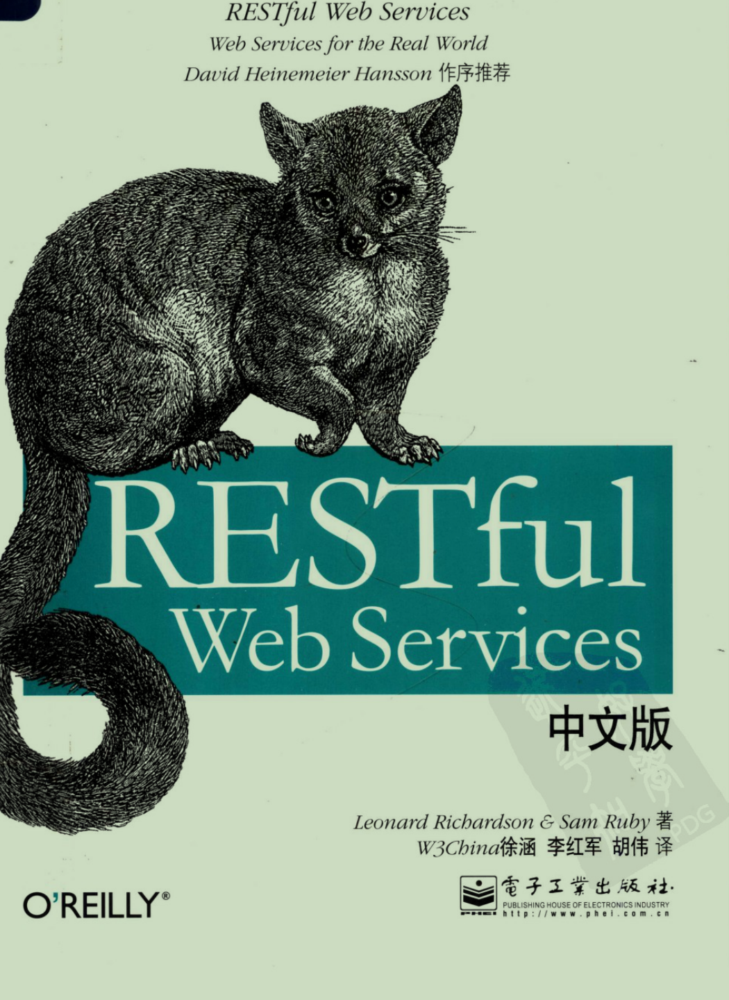
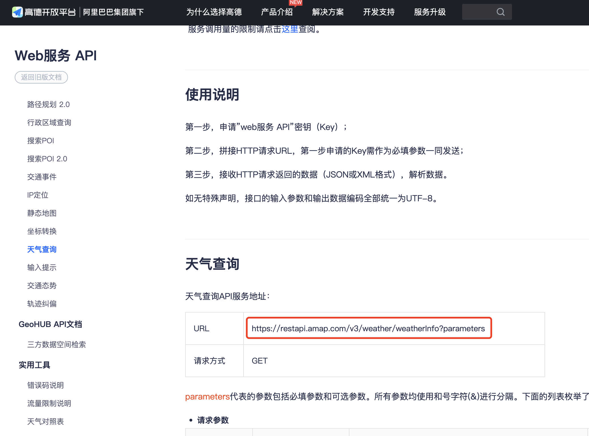
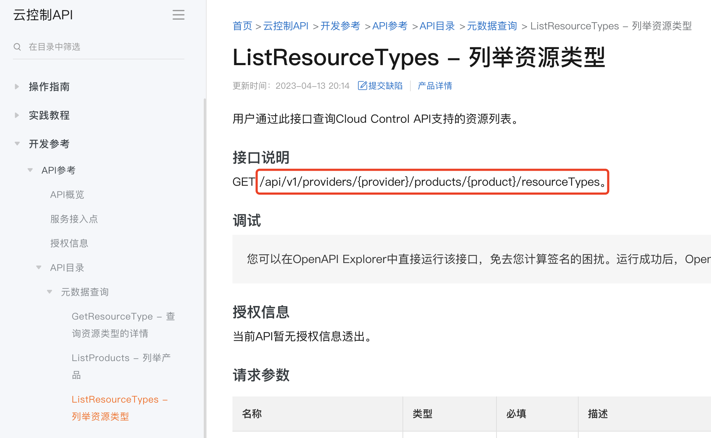
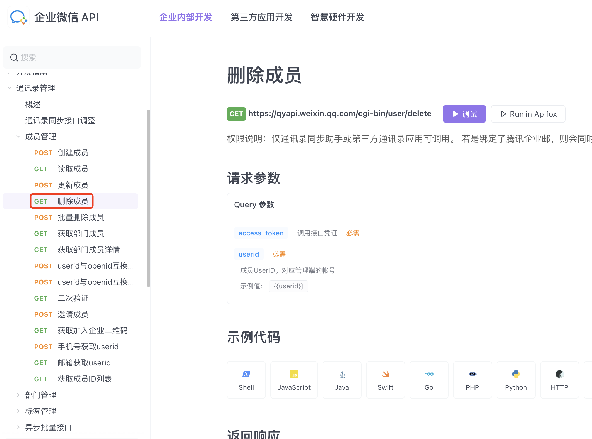
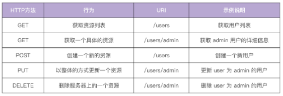

# RESTful API 设计指南 - 开篇词

## 引言

“五年后的今天，我终于学会了RESTful API。”

以上，就是我最近一个月的心路历程。入职新公司不到2周，自己都还没完全理解RESTful API就要求给校招应届生培训，着实压力山大。培训结束后也感觉收获颇丰，遂总结分享出来，希望对你有所帮助。

网上的文章比较零散，大多数讲 RESTful API 都是浅尝辄止，看完后我的印象只停留在 HTTP方法代表操作（如GET表示查询）、HTTP状态码代表结果（如200代表成功）等很浅的层面。

经过这些年的发展，特别是自 2015年 Swagger 规范更名为 Open API 后，一直到 OpenAPI 3.0.0 第一个正式版本的推出，陆陆续续类似 VS Code 和 PostMan 等工具开始涌现支持其语法的各种插件，到目前落地 RESTful API 变得越来越简单。

于是，我决定写一个系列文章，来记录和分享 RESTful API 设计的相关心得，也算是给自己一个交代。

## REST 和 Web

2000年，HTTP规范的主要作者之一，菲尔丁发表了博士论文[《基于网络的软件体系结构风格与设计》](https://www.ics.uci.edu/~fielding/pubs/dissertation/top.htm)，首次提出了名为“表现层状态转移”（REST）的互联网体系架构：


  
但是直到2008年，《RESTful Web Services》一书的推出，才系统性的讲述了如何设计REST式API风格：



在本书中，作者将其称之为面向资源的架构（Resources-Oriented-Architecture，简称ROA），这也是本书的最大亮点，补齐了我在 RESTful 理论知识方面的不足：


  
ROA（面向资源的架构） 和 OOP（面向对象编程）的思想有点类似（一切都是资源 vs 万物皆对象），主要强调如何利用 HTTP 应用层协议来操作这些资源，实现资源的增删改查。

不过到真正流行起来，成为 HTTP API 的事实上的标准风格规范，应该是从 Github 和 Google 开放的 API 使用 RESTful 风格开始（大概在2012年以后），才纷纷引得其他各大国内外互联网公司深入研究和使用。

但很奇怪的是，至今为止，我去看了[高德地图WebAPI](https://lbs.amap.com/api/webservice/guide/api/weatherinfo)、[企业微信API](https://qiyeweixin.apifox.cn/api-10061202) 和 [阿里云部分API](https://help.aliyun.com/zh/cloud-control-api/developer-reference/api-cloudcontrol-2022-08-30-listresourcetypes)，实际使用 RESTful 风格的互联网公司可能并没有那么多，这可能是为什么面试中很少会有面试官问 RESTful 和 API 设计的相关问题（可能他们也不懂）。

> PS： 2024/04/07 更新，[TapTap的文档](https://developer.taptap.io/docs/zh-Hans/sdk/authentication/rest/) 是为数不多，国内使用 RESTful 风格的公司之一





那么，既然面试用不到，还有啥必要学这个东西？

面试会考代码规范吗？不会，重要吗？我认为很重要，所以 RESTful 本质上就是一种规范，一种专门用于 HTTP API 设计的规范。既然是规范，主要的作用就是统一习惯和做法：大家都使用普通话交流！而不是到了一个新的公司，加入一个新的团队，需要学习一门新的方言！

下面让我们看看没有规范时，我们可能会遇到那些 API 设计问题。

## 那些有争议的API设计

> 声明：虽然作者提倡使用 RESTful 规范来设计 HTTP API，但是目前国内互联网大厂都不统一，故我们应当理解下面介绍的案例，其必定有自己的背景和理由。

### 所有的接口都使用 POST 请求

你可能听过或者刷到过这样的段子，同样 v2ex 上也有这样一个[帖子](https://www.v2ex.com/t/830030?p=1)，讨论的热火朝天：

> 对接同事的接口，他定义的所有接口都是 post 请求，理由是 https 用 post 更安全。
> 之前习惯使用 restful api ，如果说 https 只有 post 请求是安全的话？那为啥还需要 get 、put 、delete ？我该如何反驳他。

其中网友的回复有以下几种观点：

- POST挺好的，就应该这么干，沟通少
- 一把梭，早点干完早点回家
- 吵赢了又怎么样？工作而已，优雅不能当饭吃。虽然评论没有一边倒，但是也有大量的人支持

我搜索了下，觉得这个[回答](https://juejin.cn/post/7129685508589879327)比较靠谱点：

- 如果你的团队都是大佬，或者有着良好的团队规范，所有人都在平均水平线之上，并且有良好的纠错机制，那基本不会制定这样的规则。但如果团队成员水平参差不齐，尤其是小团队，创业团队，常常上来就开干，没什么规范，纯靠开发者个人素质决定代码质量，这样的团队就不得不制定这样的规范。
- 毕竟可以减少非常多的问题，Post不用担心URL长度限制，也不会误用缓存。通过一个规则减少了出错的可能，这个决策性价比极高。
- 造成的结果：公司有新人进来，什么垃圾公司，还有这种要求，回去就在群里讲段子。
- 实际上都是有原因的，有些外包公司或者提供第三方接口的公司也会选择只用Post，就是图个方便。

通过上面的一些回答，我认为比较合理的是外包公司可能会有这种规定，领导不想花力气培养新人，直接一把梭省事，避免犯错的同时还能节省学习成本。

但程序员宝贵的不就是这些经验教训吗？所以，这个规定的**受益方是公司，对个人而言没有任何好处**：它没有让你学习到任何有用的知识！甚至会让你误认为HTTP就应该这样干，**从而失去了深入学习 HTTP 和 RESTful API 的机会**。

我们会在下一章中深入探讨这个问题。

### 不管成功还是失败，HTTP状态码都返回200

HTTP 是请求-响应的通讯模型，对于客户端的请求操作，服务端需要告诉客户端操作结果，有 2 种方式：通过 HTTP 状态码或者在响应的 JSON 数据中增加一个错误码来代表操作结果。

前者需要理解 HTTP 各状态码的含义，有一定的学习成本，而后者上手简单，所以**工作经验不多的人大概率会使用第二种方式**。

也就是在返回结果中增加一个字段来代表结果，不管请求成功还是失败，服务端返回的 HTTP 状态码都是 200 OK，具体的业务结果，需要解析 JSON 数据，根据其中类似 errorCode 的字段进一步判断，以新增用户接口为例，可能会有如下设计：

```json
POST /userManager/addUser
{
   "userName":"admin",
   "nickName":"管理员",
   "userPwd":"pwd"
}

{
   "errorCode":0,
   "errorMsg":"success"
}
```

如果是查询类的接口，则除了错误码和错误描述，响应结果中会多出一个 data 字段，用来放实际的业务数据：

```json
{
   "errorCode":0,
   "errorMsg":"success",
   "data":{
      "total":0,
      "entries":[]
   }
}
```
  
这样的做法有2个缺陷：

- 数据冗余：**HTTP 是应用层协议**，已经有状态码表示操作结果了，我们又定义一个，未免太多余，白白多花流量钱，浪费带宽。另外，这种设计也体现了API设计者是把  HTTP 当作传输协议来使用，没有充分利用 HTTP 应用层协议的特性。
- 重复造轮子：为了区分不同的错误原因，我们要精心规划 errorCode ，比如0代表成功，1000-2000 代表一种失败原因，2000-3000代表另外一种。有没有发现其实 HTTP 本身已经给我们设计好了？2xx代表成功，3xx跳转，4xx代表客户端原因导致的错误（参数非法），5xx代表服务端出错。

除此之外，这种做法最大的问题是（来自左耳朵耗子的[这篇文章](https://coolshell.cn/articles/22173.html)）：**监控系统在一种低效的状态下工作**，它需要把所有的网络请求包打开后才知道是否是错误，而且完全不知道是调用端出错还是服务端出错。于是一些像重试或熔断这样的控制系统完全不知道怎么搞（如果是 4xx 错误，那么重试或熔断是没有意义的，只有 5xx 才有意义）。

我们会在下一章进一步探讨这个问题，为什么不建议你这样做，特别是微服务时代。

> PS：千万别学我，这么些年我都是这样干的，我深表惭愧。

### API命名千奇百怪

没有学习 RESTful API 规范之前，我会用 URI 来表示 API 的具体作用。

所以在设计API的名字时，我们通常会通过动词来代表具体的操作，比如新增是add，删除是delete，修改是update，但是查询的翻译就难了，有些人用query，有些人有select。

这是因为开发者对API接口设计的习惯不同，以新增员工举例，可能会出现这种情况：

```bash
http://localhost:/employee/save
http://localhost:/employee/add
http://localhost:/employee/new
http://localhost:/employee/xinzeng
http://localhost:/employee/append
http://localhost:/employee?cmd=add
```

而且请求方法和响应结果可能也是很随意的。

所以，如何设计一套科学的API接口？答案：具有 RESTful 风格的API接口。

## 一些区别

### REST 和 RESTful API 的关系

网络上经常会有人搞混，分不清 REST 和 RESTful API 的关系，所以有必要科普一下。

简而言之：**REST 是规范，而 RESTful API 是满足这些规范的 API 接口。**

REST（Representational State Transfer）表现层状态转移，是一种架构风格，由 Roy Fielding 在他的博士论文《Architectural Styles and the Design of Network-based Software Architectures》里提出。

REST 本身并没有创建新的技术、组件或服务，它只是一种软件架构风格，是一组架构约束条件和原则，而不是技术框架。而 RESTful API 特指满足这些规范的 HTTP API 接口。

**所以只要你的 HTTP 接口使用 POST/DELETE/PUT/GET 代表增删改查操作，使用 HTTP 状态码代表结果，使用 URI 代表操作对象，你的 API 就是 RESTful API。**

### REST 和 HTTP 的关系

REST 规范把所有内容都视为资源，一切皆资源，故 REST 架构对资源操作的操作包括获取、创建、修改和删除，这些操作正好对应 HTTP 协议的 GET、POST、PUT 和 DELETE 方法，HTTP 动词与 REST 风格 CRUD 的对应关系见下表：



REST 风格虽然适用于很多传输协议，但在实际开发中，由于 REST 天生和 HTTP 协议相辅相成，因此 HTTP 协议已经成为了实现 RESTful API 事实上的标准协议。

## 总结

本章我们向大家推荐了一本书籍[《RESTful Web Services》](https://book.douban.com/subject/2054201/)，通过阅读 "第4章 面向资源的架构"我们可以补足 RESTful API 理论知识（我很少看到有人推荐这本书）。

我们通过对比 REST、RESTful API 和 HTTP 的关系，以及给出了 REST 风格架构的出处（[博士论文](https://www.ics.uci.edu/~fielding/pubs/dissertation/top.htm)），让大家初步了解了 RESTful API 的前后今生。

在文章的中间部分，我们阐述了没有 API 规范的情况下，可能会遇到的3个问题：

- 所有的接口都使用Post请求
- 不管成功还是失败，HTTP状态码都返回200
- API命名千奇百怪

这几个问题通常发生在不同的公司、不同的团队，如果你跳槽过几次，可能会遇到类似的问题。不同的公司有不同的API规范（大部分没有），我们最好使用在全世界范围内的主流规范风格（RESTful API），避免不必要的口水，最主要的是能得到成长，对于我们这些普通人，成长就是一切。

在后续的文章中，我会：

- 分析上面做法的优劣
- 介绍目前公司在使用的 API 规范，你可以直接拿过去用
- 介绍 OpenAPI 规范和 API 开发工具，以及 MQ 异步 API 规范
- 介绍几个实战案例，带你入门 RESTful API 设计
- 解读和介绍主流 Azure 和 Google 团队的 RESTful API 规范

## 参考

- 为什么有公司规定所有接口都用Post？[https://juejin.cn/post/7129685508589879327](https://juejin.cn/post/7129685508589879327)
- 一把梭：REST API 全用 POST？[https://coolshell.cn/articles/22173.html](https://coolshell.cn/articles/22173.html)
- 对接同事的接口，他定义的所有接口都是 post 请求，理由是 https 用 post 更安全：[https://www.v2ex.com/t/830030?p=1](https://www.v2ex.com/t/830030?p=1)