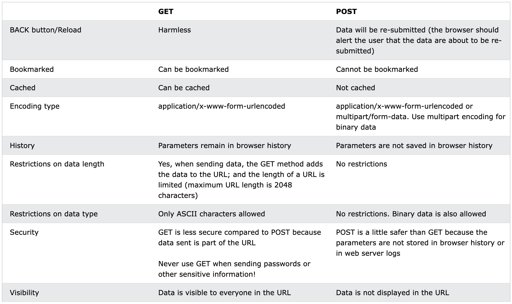

# RESTful API 设计指南 - 为什么要用（上）

## 引言

在上一篇中： [RESTful API 设计指南——开篇词](01_开篇词.md)

我们介绍了几个十分有争议性的案例：

- 所有的接口都使用Post请求
- 不管成功还是失败，HTTP状态码都返回200
- API命名千奇百怪

本章我们来深入分析一下，为什么不要像案例中所说的那样干？

RESTful 规范能解决这些问题吗？

## 问题浅析

### 为什么不要所有的接口都使用POST

我们首先来看一下 GET 和 POST 的区别（来源文章）：

- GET 请求有长度限制（数据放在URL中），而 POST 没有
- GET 数据都放在 url 中，复制到浏览器可以直接打开（各种分享功能），而 POST 数据放在 body 中，无法分享
- GET 可以被缓存（CDN），能减少服务器压力，而 POST 请求永远不会被缓存
- GET 请求会被保存到浏览历史记录中，POST 不可以
- GET 请求可以使用回退/刷新功能，而 POST 通常不可以
- GET 请求可以被保存为书签，POST 不行
- GET 请求不应该包含有敏感数据，因为它可以在地址栏、书签和浏览历史中看到
- GET 请求仅用于查询数据，而不是修改



通过上面的对比，我们看到 GET 和 POST 都有各自的使用场景，假设你要做一个分享功能，或者一个博客，那么可以被添加为书签或者能直接在浏览器地址粘贴打开是必须的，否则将会丢失很多从收藏夹过来的阅读量。

所以，在早期的 MVC 时代（前后端在一起），肯定不能所有的请求都是 POST，否则有一些功能将会无法实现。

那么在当下前后端分离的时代呢？后端接口通常是提供给前端使用的，用户不会直接接触到这些后端接口，可以都使用 POST 请求吗？ 

在前后端分离架构下，团队分工发生了变化：由 Java 干所有事情，变成了前端开发 + 后端开发的组合，这意味分工的精细化，前端除了功能实现，还会关注界面美观和用户体验；后端会关注性能、并发和可用性等一些非功能需求。从这个角度而言 GET 能使用 CDN 缓存，限制 GET 只用来查询，POST用来修改，从而可以通过读写分离机制提升整体服务的性能和可用性就很关键了。

所以，在前后端分离和微服务架构的时代的今天，功能只是整个后端开发中的一部分，有时甚至非功能需求的工作量远远大于功能性需求，所以，不太可能出现所有接口都使用 POST 请求这种情况。

另外，伴随着云计算时代的到来， K8S 和 Docker 容器化部署几乎成为了后端的必备技能之一，而 K8S 其中的一个机制：健康检查就要求服务提供一个 HTTP GET 接口，返回200 OK 代表服务已准备就绪，K8S 才会开放流量给该进程。所以，也不可能只提供 POST 接口的。

当然，微服务中还会伴随各种疑难问题，比如监控、压测、流控、路由和权限等等，可以参考这篇文章了解：[RESTful复杂查询](https://coolshell.cn/articles/22173.html#Restful_复杂查询)，也没办法只使用 POST 请求。

### 为什么要区分 HTTP 状态码

在上一篇文章： [RESTful API 设计指南——开篇词](01_开篇词) 中，我们有说过，如果不区分 HTTP 状态码，不管成功还是失败都返回200 OK，这样做最大的问题是：监控系统在一种低效的状态下工作。

原因是监控系统需要解析你的 Body，才能知道是调用方出错还是服务端。这里的监控系统只是一个概念，泛指指基础设施或者第三方监控系统，可以是 nginx、k8s 的 ingress 、api 网关（kong 和 Spring Cloud Gateway等）或者 promethus 等等。

这里我们以大家熟知的 Nginx 举例来说明，它在什么地方会用到 HTTP 状态码。

Nginx是主流的Web服务器之一，除了可以做 HTTP 或 TCP 代理之外，最常用的一个功能就是做负载均衡。

Nginx 中实现负载均衡的是 upstream（[ngx_http_upstream_module](https://nginx.org/en/docs/http/ngx_http_upstream_module.html)） 模块，比如下面的例子：

```conf
upstream test {
    server 10.78.3.1:80 fail_timeout=60s max_fails=2; # Server A
    server 10.78.3.2:80 fail_timeout=60s max_fails=2; # Server B
    server 10.78.3.3:80 backup; # Server C
}
```

- 配置了3个节点，默认负载均衡算法是轮询，意味着请求会被均摊给 A B C 三台服务器
- 每个 Server 还可以单独配置策略，比如上面虽然有3台服务器，但是 C 因为指定了 backup ，所以只有当 A B都繁忙时才会被分配请求，正常情况下，它的压力最小

upstream 是一个非常强大的模块，除了轮询负载算法还支持 ip_hash、fair、url_hash 等算法，另外每个节点支持很多配置：

- down：表示当前的 server 临时不參与负载
- weight：表示负载的权重，配置的越大，分配到的请求数就越多
- max_fails ：请求失败的次数，当超过最大次数时，返回 proxy_next_upstream 模块定义的错误
- fail_timeout : max_fails 次失败后，暂停请求的时间，这期间该服务不会收到任何请求

更多关于 upstream模块 的介绍可以参考[官网](https://nginx.org/en/docs/http/ngx_http_upstream_module.html)和这篇文章：[nginx upstream配置说明负载均衡](https://www.jianshu.com/p/50dfb0d69983)

upstream 模块通常搭配 http代理模块（[ngx_http_proxy_module](https://nginx.org/en/docs/http/ngx_http_proxy_module.html#proxy_next_upstream)）使用，用来实现 HTTP 代理转发（还支持4层代理，如TCP和UDP等），比如下面的例子：

```conf
http {
    # 负载均衡，名称是 test
    upstream test {
        server 10.78.3.1:80 fail_timeout=60s max_fails=2; # Server A
        server 10.78.3.2:80 fail_timeout=60s max_fails=2; # Server B
        server 10.78.3.3:80 backup;                       # Server C
    }
    server {
       listen 9998;
       server_name pub_api;
       # 转发到 test 负载均衡上
       location / {
           root html;
           proxy_pass http://test;
       }
    }
}
```

我们配置了一个具有3个节点的 Web 服务器集群，通过 9998 端口统一对外暴露服务，这样上层系统就只需要知道一个 IP 地址，并且当其中某一个节点出问题时，Nginx 会通过负载均衡算法帮我们把请求转发到其他可用的节点上。

那这里和 HTTP 状态码有什么关系呢？

在上面的 location 节点中，我们还可以配置各种超时和重试策略：

```conf
location / {
    root html;
    proxy_connect_timeout 5s;
    proxy_read_timeout 100s;
    proxy_send_timeout 70s;
    proxy_next_upstream error timeout;
    proxy_next_upstream_timeout 70;
    proxy_next_upstream_tries 1;
    proxy_pass http://efast-public;
}
```

我们着重看一下失败重试的配置项 proxy_next_upstream。

根据 [官方的文档](https://nginx.org/en/docs/http/ngx_http_proxy_module.html#proxy_next_upstream)，它的语法如下：

```conf
Syntax:proxy_next_upstream error | timeout | invalid_header | http_500 | http_502 | http_503 | http_504 | http_403 | http_404 | http_429 | non_idempotent | off ...;
Default:proxy_next_upstream error timeout;
Context:http, server, location
```

- error：读写出错
- timeout：超时
- invalid_header：头信息有误
- non_idempotent：RFC-2616定义的非幂等HTTP方法（POST、LOCK、PATCH），也可以在失败后重试（默认幂等方法GET、HEAD、PUT、DELETE、OPTIONS、TRACE）
- off：表示禁用重试
- http_500：当服务返回 500 错误码时，重试请求
- http_403：当服务返回 403 错误码时，重试请求
- ...

发现了吗？

它可以根据 HTTP 状态码来决定是否需要重试，如果我们不区分 HTTP 状态码，不管成功还是失败，是客户端参数导致的错误，还是服务器内部的错误都返回200的话，我们是没有办法使用 nginx 失败重试的功能的，除非你修改它这个模块的源码！

### API命名问题

还记得上文提到过的API命名问题吗？

以新增员工为例，因为开发习惯不同，可能会出现这些情况：

```bash
http://localhost/employee/save
http://localhost/employee/add
http://localhost/employee/new
http://localhost/employee/xinzeng
http://localhost/employee/append
http://localhost/employee?cmd=add
http://localhost/add_employee
```

- 把新增翻译为 save、append、new，或者干脆用拼音
- 把参数放在 query 中，比如通过 cmd=add 来代表具体的操作。
- 直接在 path 中拼接2个单词

除了上述问题之外，这个新增员工接口是发 POST 还是 GET 请求？是通过 HTTP 状态码代表操作结果，还是需要解析 json 来判断？如果是解析 json ，那个字段代表成功？等等这些问题，需要我们仔细的查阅它的 API 文档才能下定论。

那么，RESTful API 是如何解决这些的问题的呢？

在《RESTful Web Services》这本书的第4章：面向资源的架构中，为我们做出了解答：统一接口！

> 客户端与资源之间的所有交互，都是通过为数不多的几个HTTP方法进行的。任何资源都将暴露这些方法的一个子集，而且这些方法无论被哪个资源暴露，都具有相同的意义。

即对于任何资源，增删改查统一使用 HTTP 方法来表示：

- 发送 GET 请求，代表查询
- 发送 PUT 请求，代表修改
- 发送 POST 新增，代表新增
- 发送 DELETE 请求，代表删除

如下是一个使用 HTTP 方法来代表操作的一个示例：

| 请求方法 | URL | 描述|
|-|-|-|
|GET|/departments|获取所有部门信息|
|POST|/departments|新增一个新的部门|
|GET|/departments/{departmentid}|获取指定部门详细信息|
|PUT|/departments/{departmentid}|更新指定部门信息|
|DELETE|/departments/{departmentid}|删除指定部门|

所以，按照 RESTful API 规范，新增操作必须发送 POST 请求，至于具体是新增什么，需要由 url 来决定：

```bash
POST /employees        # 新增员工
POST /departments      # 新增部门
POST /roles            # 新增角色
```

至此，增删改查接口命名的问题解决了，在 RESTful API 中，看到 POST 就代表这是一个新增接口，看到 GET 就知道这个接口是用来查询的。至于具体的含义，需要结合资源名（path）来看。另外，资源通常使用名词表示，也就意味着 path 中不应该出现动词，关于这些我们会在后续的文章中详细说明。

## 总结

本章我们详细介绍了在 HTTP API 设计中可能会遇到的一些典型的非常具有代表性和争议的案例，我们应该极力避免案例中的做法。

对于“所有的接口都使用Post请求”的案例，我们给出了足够多避免这样做的理由，比如 POST 和 GET 的适用的场景不同，健康检查需要提供 GET 请求、不利于读写分离和监控系统配合等。

对于"不管成功还是失败，HTTP状态码都返回200”的案例，我们也通过介绍 Nginx 的 HTTP 代理功能，介绍了微服务时代下，服务和基础设施之间配合的问题。

对于“API命名千奇百怪”的案例，我们介绍了为什么引入 REST 规范能避免该问题，因为 RESTful  API 统一了操作接口，增删改查使用 HTTP 方法表示，从此，对于各个团队，大家的玩法都一样了。

在本章中，我们介绍了一些使用 RESTful API 风格的带来的收益和好处，而在下一章中，我们会介绍一下它的劣势，毕竟，软件世界中没有银弹。

参考：

- [nginx upstream配置说明负载均衡](https://www.jianshu.com/p/50dfb0d69983)
- [Ingress](https://kubernetes.io/zh-cn/docs/concepts/services-networking/ingress/)
- [ngx_http_upstream_module](https://nginx.org/en/docs/http/ngx_http_upstream_module.html)
- [ngx_http_proxy_module](https://nginx.org/en/docs/http/ngx_http_proxy_module.html#proxy_next_upstream)
- 《微服务架构》
- [TapTap 开发者服务 RESTful API](https://developer.taptap.cn/docs/v2/sdk/storage/guide/rest/#登录)
- [github api](https://docs.github.com/en/rest/gists/gists?apiVersion=2022-11-28)