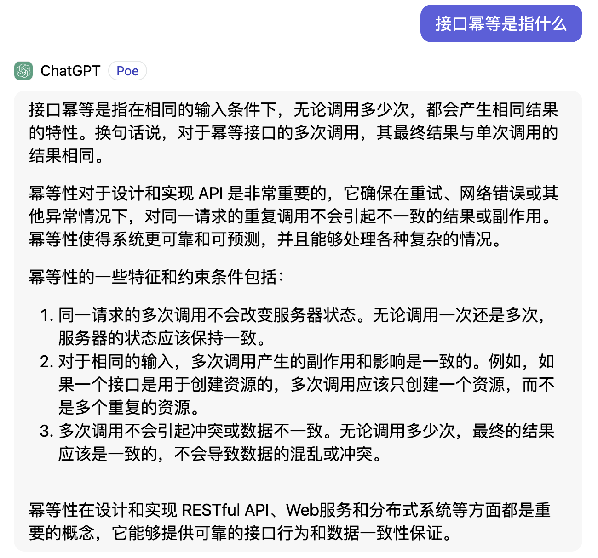
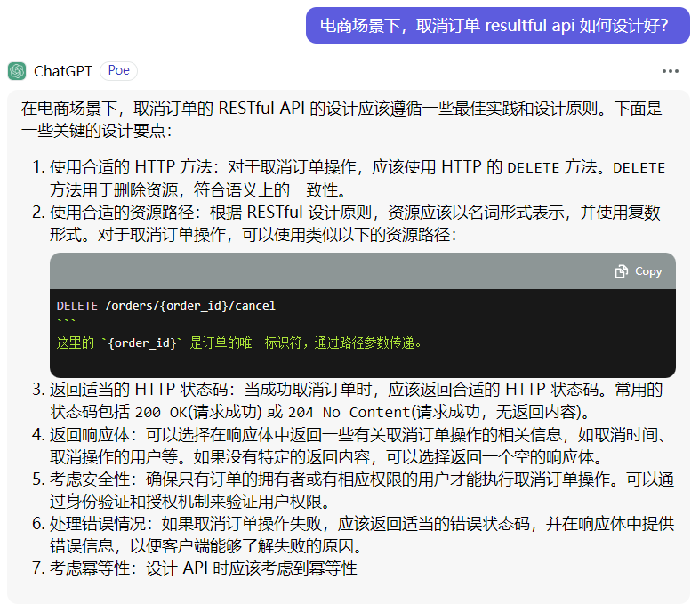
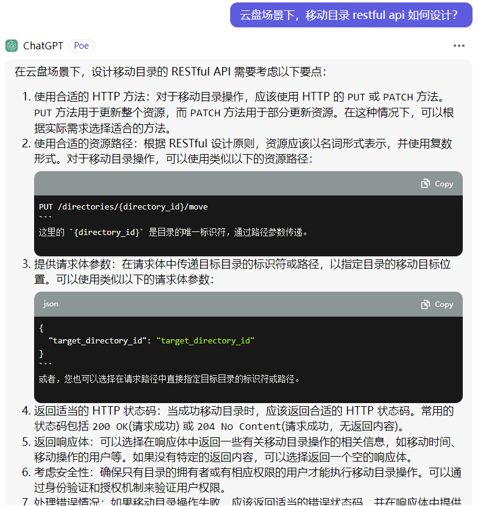

# RESTful API 设计指南 - 为什么要用（下）

## 引言

在上一篇文章： [RESTful API 设计指南——为什么要用（上）](02_为什么要用（上）.md)中，我们从最具有争议的 HTTP API 设计案例入手，详细介绍了为什么不要 POST 一把梭，为什么不要 HTTP 状态码不能只返回 200。其实这些问题的答案，就是使用 RESTful API 规范。

当然，软件的世界没有银弹，RESTful API 也同样有着他的缺点，比如它有一定的学习成本，会面临思想上的一些变化以及在实施时会经常面临下文中提到的几个问题。

不过总体而言，瑕不掩瑜，在 HTTP API 方面，使用 RESTful API 风格基本上已经成为了主流的标准风格之一，还是值得学习和掌握的。

接下来让我们看看使用 REST 规范可能会遇到那些问题。

## RESTful API 的劣势

### 有时很难将操作映射为 HTTP 动词

上文我们介绍了统一接口的概念：

> 客户端与资源之间的所有交互，都是通过为数不多的几个基本HTTP方法进行的。任何资源都将暴露这些方法的一个子集，而且这些方法无论被哪个资源暴露，都具有相同的意义。
> 具体参见《RESTful Web Services》第四、八章，统一接口部分。

即所有对资源的增删改查都使用 POST、DELETE、PUT、GET 等有限的几个 HTTP 方法来表示，而根据 API 功能决定使用什么 HTTP 方法的过程，我们把它称为映射。

简单的CURD业务操作我们能很容易的映射到对应的HTTP动词（方法）：

```bash
POST     /users     # 增加用户
DELETE   /users/1   # 删除id为1的用户
GET      /users     # 查询系统所有用户
GET      /users/1      # 查询id为1的用户详细信息
PUT      /users/1       # 修改id为1用户的信息
```

但是有时候有一些操作没办法简单的对它进行映射，比如：

- 登录接口，类似的还有登出接口
- github的star操作
- 取消订单

以上这些场景，应该映射到 HTTP 的那个动词呢？这是一个查询（GET）、新增（POST）、修改（PUT）还是删除（DELETE）操作？

好像没法一眼看出：

- 登录可以映射到 POST 吗？属于新增操作？好像不是。那映射到 PUT 属于修改操作 ，因为登录可以认为是对在线状态的修改操作？或者使用 GET 方法，因为要校验用户名密码，所以这是一个查询操作？
- github的star操作初看像是新增操作，但是仔细想一下又不合理，因为对同一个仓库，同一用户只能 star 一次
- 取消订单第一反应像是修改订单状态，可以使用 PUT 方法，但是 RESTful API 又要求 PUT 是幂等的，而一个订单也无法多次取消

所以，类似以上映射到 HTTP 动词难的问题，导致了 REST 替代方案的日益普及，例如 gRPC 技术，不过 gRPC 更多的应用于后端服务之间的通信中，很少有客户端直接使用 gRPC 调用服务端的场景，大家都习惯了浏览器 + F12 的排查手段，如果使用 gRPC 风格，会导致问题的排查很困难以及由此延伸的各种问题。

让我们以登录接口举例，来深入分析一下，应该映射到 HTTP 的什么方法。

我们先从 GET 方法思考：登录接口可以使用 GET 方法吗？为什么这么说？因为要校验用户名和密码啊，需要查询数据库，所以这是一个查询操作，而查询在 RESTful API 中对应的是 GET 方法。

但是如果我们从安全性方面考虑，根据 GET 的特性，参数需要放在 url 中，你肯定不希望你的用户名和密码出现在浏览记录中或者能被人随意复制URL进行分享吧？所以是不是可以直接排除了。另一方面，查询动作是不会改变服务器的数据的，但是登录至少会使得服务器创建新的token，导致了数据和状态的改变，也不适合使用 GET。

那么，就要从 POST 和 PUT 中选择了，这个时候我们可以从接口的幂等性角度再进一步分析。

接口幂等是什么意思？我们问一下 ChatGPT



举例：

> 假设现在有一个新增部门的接口（部门名称可以重复），调用n次，就会导致数据库表新增对应个数的部门，所以一次和多次的影响是不一样的，该接口就不是幂等的。
> 通过部门ID查询部门名称，无论调用多少次，结果都是一样的（数据库不会多一条或者少一条记录），修改和删除部门的操作也是一样的，修改1次、10次和删除1次和10次的影响是一样的。

常见HTTP方法的幂等和安全性如下表：

|HTTP方法|幂等|安全|
|-|-|-|
|OPTIONS|yes|yes|
|GET|yes|yes|
|HEAD|yes|yes|
|PUT|yes|no|
|POST|no|no|
|DELETE|yes|no|
|PATCH|no|no|

通过上表，我们发现 POST 不是幂等的，多次重复的行为会造成不一样的结果。而 PUT 被定义为幂等，所以它的多次调用造成的影响应该是一样的。

那么从登录这个行为来看，登录一次可能会有登录记录产生，会把别人踢下线（不允许重复登录或进行次数限制），会导致在线状态改变和产生相关事件等等，这个行为的多次触发，对应到数据库表中就是多次 INSERT 插入操作，所以登录接口肯定不是幂等的，套用到 RESTful API 中，就只能使用 POST 了。

题外话：有时候遇到问题，可以看看别人的 API 设计，比如 [TapTap 开发者服务 RESTful API](https://developer.taptap.cn/docs/v2/sdk/storage/guide/rest/#登录) 接口中的登录就是使用的 POST。

### 把操作映射到 PATH 也有点难

上文我们讨论了为 API 选择合适的 HTTP 方法的问题，有时候需要一些深入分析才能找到合适的方法。同样，另外一个经常遇到的问题就是：如何命名我们的 API ？PATH 部分应该怎么设计更合理？

在前面的文章中，我们提到了统一接口，RESTful API 中用 HTTP 方法代表操作，所以 API 接口名再涵盖一个动词就显得很多余，比如：

```bash
POST /members/addMember   # addUser显得很多余，POST已经代表新增了
POST /members             # 很好，这才是真正的 RESTful API 风格
```

这也是为什么 RESTful API 中建议**资源名使用名词命名**的原因，如果资源是集合类型，最好使用复数形式表示，比如上面的 /members 会比 /memeber 好，意味着我向一个成员集合中新增一个成员。

按照这个原则，针对 CRUD 中的创建场景，我们可以很轻松的设计出一系列创建的API：

```bash
POST /users    # 创建用户
POST /groups   # 创建群组
POST /articles # 创建文章
POST /orders   # 创建订单
```

但是，当某一个 API 比较抽象时会怎么样？

比如 github 的 star 操作，当某个用户点一次加星就是新增一个计数 ，看起来可以对应到新增，所以初步定义它的API为：

```bash
POST /gists/{repoId}/stars  # 仓库下面维护一个用户加星列表，加星就是创建一个关系？
POST /stars                 # 或者直接这样？
```

好像也不合理，不能多次 star，这肯定不是新增操作，再说有新增就有查询和删除，好像更不对了。

这个时候，我们看看 [官方](https://docs.github.com/en/rest/gists/gists?apiVersion=2022-11-28#star-a-gist) 是如何设计的：

```bash
PUT /gists/{gist_id}/star      # 加星
```

- 定义了一个用于更新资源特定方面的子资源，即把加星等动作变成了一个名为 star 的子资源
- 使用 PUT方法 ，代表这是一个修改操作，并且是幂等的，可以重复多次调用，但是永远只生效一次，也很好的对应了对一个仓库最多只能 star 一次 
- PATH设计为：/gists/{gist_id}/star，则当我们要对仓库1加星时，完整请求为 PUT /gits/1/star

既然把一个动作设计为子资源，那么对应的取消和查询也很好理解了：

```bash
GET /gists/{gist_id}/star      # 获取是否加星过
DELETE /gists/{gist_id}/star   # 取消加星
```

从 GitHub 这个很巧妙的设计中，我们发现相比粗暴的直接把行为写在 URL 中需要费更多的脑子，才能写出符合 RESTful 规范的API（或者某些 API 尽量符合）。

除了上面的方案，另一种通用解决方案是：将动词指定为URL的查询参数，则加星的 url 可以设计成下面的样子：

```bash
POST /gists/{gist_id}/edit?type=star
```

至于那种更好，其实这2种方案都不是很符合 RESTful 的要求，但是迫于无奈实际项目中或多会少会使用这2种解决方案，如果从 REST 世界一切都是资源的角度出发，我认为把动作设计为子资源的方式会更好。

那么，上文提到的取消订单的 URL 怎么设计，其实也明确了：

- 方案一：定义用于更新资源特定方面的子资源，即把取消动作定义成一个子资源。

```bash
POST /orders/{orderId}/cancel    # 取消订单
POST /orders/{orderId}/revise    # 修改订单
```

- 方案二：将动词指定为URL的查询参数。

```bash
POST /orders/{orderId}/edit?type=cancel
```

### 在单个请求中获取多个资源

在书《微服务架构设计模式》中详细描述了该问题：
> REST 资源通常以业务对象为导向，例如 Consumer 和 Order。因此，设计 REST API 时的一个常见问题是如何能够使客户端能够在单个请求中检索多个相关对象。例如，假设 REST 客户端想要检索 Order 和 这个 Order 的 Consumer。纯 REST API 要求客户端至少发出两个请求，一个用于 Order，另一个用于 Consumer。更复杂的情况需要更多往返并且遭受过多的延迟。

> 此问题的一个解决方案是 API 允许客户端在获取资源时检索相关资源。例如，客户可以使用 GET /orders/order-id-1345?expand=consumer 检索 Order 及其 Consumer。请求中的查询参数用来指定要与 Order 一起返回的相关资源。这种方法在许多场景中都很有效，但对于更复杂的场景来说，它通常是不够的。实现它可能很耗时。这导致了替代技术的日益普及，例如 GraphQL（http://graphql.org）和 Netflix Falcor（http://netflix.github.io/falcor），它们旨在支持高校的数据获取。

书中描述的问题，本质上也和上文中提到的映射到HTTP动词难的问题类似，RESTful 世界中，一切都是资源，但是在API网关（BFF层，服务于前端的后端）的设计模式中，这种提供了一个大接口聚合各种小接口的场景就很难映射到某个资源，造成了一些割裂。这一块，作者的经验较少，等待后续实际遇到再进行补充。 

## 利用 AI 解决 API 设计问题

上述提到的问题，如果我们没有很好的思路，可以尝试询问 AI 来得到设计灵感，比如：





## 小结

本文介绍了使用 RESTful API 可能会经常遇到的3个问题：

- 有时很难将操作映射为 HTTP 动词
- 把操作映射到 PATH 也有点难
- 在单个请求中获取多个资源

也介绍了2种通用的解决方案：

- 定义用于更新资源特定方面的子资源。例如 Order Service 订单服务具有用于取消订单的 POST /orders/{orderId}/cancel 端点，以及用于修改订单 POST /orders/{orderId}/revise 端点。
- 将动词指定为URL的查询参数。例如 POST /orders/{orderId}/edit?type=cancel

我认为这些问题是学习 RESTful API 必须要面对和克服的，REST 是一种全新的思想（面向资源），就像从C语言面向过程，到学习Java面向对象编程一样，这种涉及到思想上的转变，确实是一个很不容易的过程，一时半会理解不了很正常。或许换一个环境，照葫芦画瓢也是一个很不错的办法，用到了再学，也不失为一种选择！

所以，这也许是我这么多年没学会 RESTful API 的根本原因，没有意识到这不是一种具体的技术，而是设计模式、原则指导等一些软技能。

至此，我们介绍了要用 RESTful API 的初衷：避免API设计的各种口水，大家都向标准看齐。也介绍了 RESTful API 的缺点和2种通用的解决方案。

从下一章开始，我们将开始正式学习 RESTful API 规范之旅，敬请期待。
