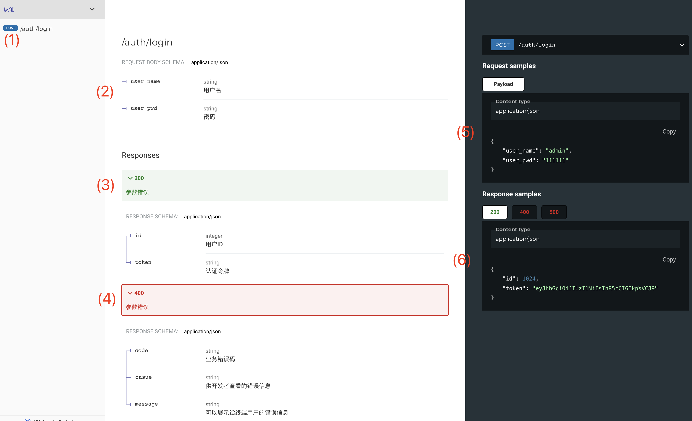
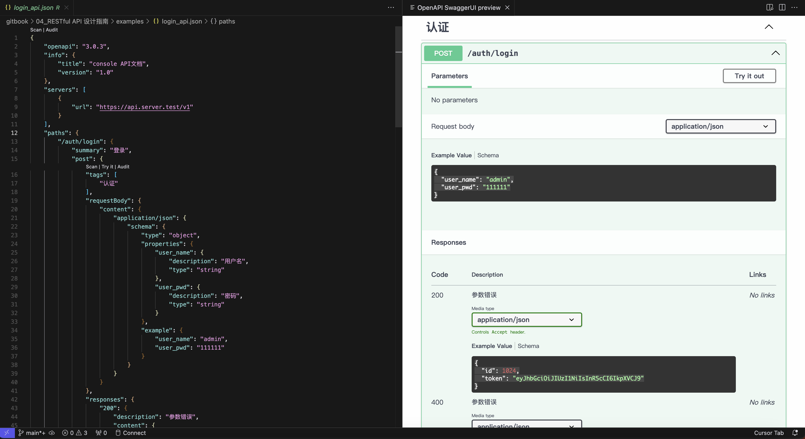
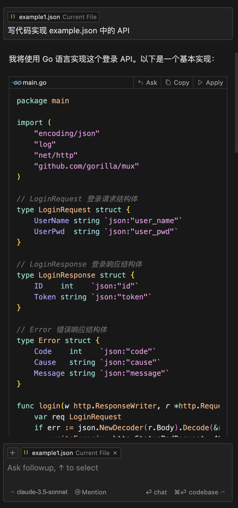

# 如何实现RESTful API（中）

## 引言

在上文 [04_如何实现RESTful API（上）](./04_如何实现RESTful%20API（上）.md) 中，我们介绍了实现 RESTful API 的关键是正确的使用 HTTP 协议，本文我们将结合2个案例来进行入门：

* 登录 API 的设计与实现
* 一个部门管理 CURD 功能 API 的设计与实现

每个例子都包含2个部分：

* RESTful API 设计
* go 代码实现

下面，让我们先从登录 API 的设计开始！

## 项目背景

现在需要开发一套类企业微信的内网沟通工具，后端采用微服务架构，你负责其中 console 端的开发，主要提供组织架构、用户和权限角色等管理功能，现在你打算使用 RESTful API 风格实现和前端交互。

按照以往成功的项目经验，你打算先把 API 设计好，这样前后端就可以一起开发，最后联调上线。

让我们先从登录API的设计开始，然后再来设计部门管理的API。

## 登录 API 的设计与实现

### API 分析与设计

这个系统我们使用用户名和密码来进行登录验证，更复杂的登录方式（如短信和第三方社交软件快捷登录认证）并不在我们的讨论范畴。

前端界面上给用户提供了账户输入框和密码输入框，所以我们的 API 至少需要2个参数：

* user_name: 代表用户输入的账户
* user_pwd：代表用户输入的密码（注意，主流做法是加盐hash，不传输明文）

当后端校验通过后，登录 API 需要发放一个有时效的令牌（token）返回用户（前端界面），以能通过后续部门管理 API 的鉴权操作。

按照上文的4个步骤，我们来逐步确定这个 RESTful API。

* 设计好 URL 和 HTTP 主体
* 正确选择 HTTP 方法
* 充分利用 HTTP 报头
* 正确选择 HTTP 状态码

前3个步骤是为了确定 API 的请求部分，第4个步骤是为了确定 API 的响应部分。最终我们会得到如下的API：



图1：登录 RESTful API 文档示例

下面，让我们按照上述4个步骤，来设计我们的第一个 RESTful API 吧！

#### 1）设计好 URL 和 HTTP 主体

在前面的文章 [RESTful API 设计指南（3）——为什么要用（下）](./03_为什么要用（下）.md) 中，我们对登录 URL 和 使用何种 HTTP 方法进行了解析，有时候 RESTful API 不能很好的映射到资源对象上，需要我们打破规范，站在使用者的角度进行思考。

所以登录 URL，我们使用了“auth/login”，login 本身是一个动词，并不符合 RESTful API 对资源必须是名词的定义，但是见名知意。当然，我们也可以询问 Chat GPT 等 AI 大模型，寻找主流 RESTful API 命名设计，选一个你认为合适的。

URL 设计完成后，我们来设计 HTTP 主体部分，主要分成：

* 请求体：客户端发给服务器的数据
* 响应体：服务器返回的数据

消息体可以是各种格式，字符串、xml、json、表单或者二进制等等，而 RESTful API 中都使用 json 格式，所以，我们最终的请求为：

```json
{
 "user_name": "admin",
 "user_pwd": "111111"
}
```

响应为：

* 成功，则返回的状态码为 200 OK

```json
{
 "id": 1024,
 "token": "eyJhbGciOiJIUzI1NiIsInR5cCI6IkpXVCJ9"
}
```

* 异常，则返回的状态码分2大类，如果是客户端参数等问题导致的异常，返回 4xx 错误，如果是服务端内部异常，返回 5xx 错误，但不管是那种错误，返回的消息体都是一样的

```json
{
 "code": 40000001,
 "casue": "hello-restapi.go:12 user_name 参数为空",
 "message": "参数不能为空"
}
```

也就是 "图1：登录 RESTful API 文档示例" 中（3）（4）（5）（6）的部分。在异常的字段中，code 是给机器使用的，用以判断具体的错误原因给出下一步动作，casue 是给排查问题使用，message 是显示给用户的信息，可以根据业务灵活调整，后续有机会再深入介绍。

#### 2）正确选择 HTTP 方法

登录会产生日志，可能会踢人下线，可能会产生上线通知等等，所以从接口幂等角度看，登录一次和登录多次的行为是不一样的，故我们需要使用不幂等的 HTTP 方法，GET、PUT 和 DELETE 都是幂等的，所以我们只剩下 POST 可以选择。

也就是 "图1：登录 RESTful API 文档示例" 中 （1）的部分。


更多关于各种 HTTP 方法的对比和幂等性在前文有详细介绍：

* [RESTfulAPI设计指南（2）——为什么要用（上）](./02_为什么要用（上）.md)
* [RESTfulAPI设计指南（3）——为什么要用（下）](./03_为什么要用（下）.md)

#### 3）充分利用 HTTP 报头

本案例中，我们不涉及一些公共参数的传递，故无需携带 HTTP 头，但是当我们认证完成返回 token 给客户端时，后续的请求都需要携带 token，此时我们就可以利用 HTTP 协议中的 "Authorization"，这个部分在案例2中会介绍。

#### 4）正确选择 HTTP 状态码

至此，我们 RESTful API 的定义就完成了，后续仅需要根据 API 处理结果，正确的返回 HTTP 状态码即可。通常高频使用的状态码如下：

* 2xx 系列：
  * 200 OK
  * 201 Created
  * 204 No Content
* 4xx 系列：
  * 400 Bad Request
  * 403 Forbidden
  * 404 Not Found
  * 409 Conflict
* 5xx 系列：
  * 500 Internal Server Error
  * 503 Service not aviliable

登录场景的几种情况和对应状态码可能为（仅参考）：

* 成功：返回200
* 用户名或密码为空：返回 400
* 用户名和密码不匹配或不正确，返回 403
* 用户不存在：可考虑返回 404，也可以返回 403
* 用户被禁止登录：409 或者 403

### OpenAPI 规范简介

通过上面的步骤，我们确定了登录 API 的所有细节，此时，一个很关键的问题是：我们的 API 如何管理？或者说如何分享给团队其他成员？使用何种工具？选择代码生成，还是手动维护？

这个时候，我们就需要了解 [OpenAPI](https://swagger.io/specification/) 规范 了：这是一种通过 json 或者 yaml 表达 API 的语法规范，可以理解成一种声明式编写 API 的语言，还记得初学 HTML 的时候吗？我们使用代码编辑器编辑 html 文件，然后通过浏览器进行渲染输出。

OpenAPI 规范也是同样的道理，我们在 VS Code 中编写，然后使用 OpenAPI (Swagger) Editor 插件进行预览，使用 redocly-cli 编译成静态 html 文件，通过 nginx，我们可以很方便的分享给任何人。

关于 OpenAPI 规范及其语法的更多细节，后续文章会深入介绍，这里我们先跳过，目前你只需要知道这是一个能帮我们很容易写出 RESTful API 文档的工具即可。

现在，让我们来创建一个 example.json ，其内容如下：

```json
{
    "openapi": "3.0.3",
    "info": {
        "title": "console API文档",
        "version": "1.0"
    },
    "servers": [
        {
            "url": "https://api.server.test/v1"
        }
    ],
    "paths": {
        "/auth/login": {
            "summary": "登录",
            "post": {
                "tags": [
                    "认证"
                ],
                "requestBody": {
                    "content": {
                        "application/json": {
                            "schema": {
                                "type": "object",
                                "properties": {
                                    "user_name": {
                                        "description": "用户名",
                                        "type": "string"
                                    },
                                    "user_pwd": {
                                        "description": "密码",
                                        "type": "string"
                                    }
                                },
                                "example": {
                                    "user_name": "admin",
                                    "user_pwd": "111111"
                                }
                            }
                        }
                    }
                },
                "responses": {
                    "200": {
                        "description": "参数错误",
                        "content": {
                            "application/json": {
                                "schema": {
                                    "type": "object",
                                    "properties": {
                                        "id": {
                                            "type": "integer",
                                            "description": "用户ID"
                                        },
                                        "token": {
                                            "type": "string",
                                            "description": "认证令牌"
                                        }
                                    },
                                    "example": {
                                        "id": 1024,
                                        "token": "eyJhbGciOiJIUzI1NiIsInR5cCI6IkpXVCJ9"
                                    }
                                }
                            }
                        }
                    },
                    "400": {
                        "$ref": "#/components/responses/Resp400"
                    },
                    "500": {
                        "$ref": "#/components/responses/Resp500"
                    }
                }
            }
        }
    },
    "components": {
        "schemas": {
            "Error": {
                "type": "object",
                "properties": {
                    "code": {
                        "type": "string",
                        "description": "业务错误码"
                    },
                    "casue": {
                        "type": "string",
                        "description": "供开发者查看的错误信息"
                    },
                    "message": {
                        "type": "string",
                        "description": "可以展示给终端用户的错误信息"
                    }
                },
                "example": {
                    "code": 40000001,
                    "casue": "hello-restapi.go:12 user_name 参数为空",
                    "message": "参数不能为空"
                }
            }
        },
        "responses": {
            "Resp400": {
                "description": "参数错误",
                "content": {
                    "application/json": {
                        "schema": {
                            "$ref": "#/components/schemas/Error"
                        }
                    }
                }
            },
            "Resp500": {
                "description": "服务器内部错误",
                "content": {
                    "application/json": {
                        "schema": {
                            "$ref": "#/components/schemas/Error",
                            "examples": {
                                "example": {
                                    "code": 5000000,
                                    "casue": "hello-restapi.go:12 SQL异常",
                                    "message": "服务器内部错误"
                                }
                            }
                        }
                    }
                }
            }
        }
    },
    "tags": [
        {
            "name": "认证"
        }
    ]
}
```

我们可以使用 vs code 进行预览：



部署时，使用 redocly（[https://github.com/Redocly/redocly-cli](https://github.com/Redocly/redocly-cli)）工具进行转换：

```bash
$ npx @redocly/cli build-docs example1.json
Found undefined and using theme.openapi options
Prerendering docs

🎉 bundled successfully in: redoc-static.html (43 KiB) [⏱ 3ms].
```

使用浏览器打开 redo-static.html 就是文章开头的 API 文档了！

## 代码实现

这里我们使用 cursor AI 编辑器来根据 example.json 生成代码：



代码内容如下：

```go
package main

import (
    "encoding/json"
    "log"
    "net/http"
    "github.com/gorilla/mux"
)

// LoginRequest 登录请求结构体
type LoginRequest struct {
    UserName string `json:"user_name"`
    UserPwd  string `json:"user_pwd"`
}

// LoginResponse 登录响应结构体
type LoginResponse struct {
    ID    int    `json:"id"`
    Token string `json:"token"`
}

// Error 错误响应结构体
type Error struct {
    Code    int    `json:"code"`
    Cause   string `json:"cause"`
    Message string `json:"message"`
}

func login(w http.ResponseWriter, r *http.Request) {
    var req LoginRequest
    if err := json.NewDecoder(r.Body).Decode(&req); err != nil {
        writeError(w, http.StatusBadRequest, 40000001, err.Error(), "参数格式错误")
        return
    }

    // 验证参数
    if req.UserName == "" || req.UserPwd == "" {
        writeError(w, http.StatusBadRequest, 40000001, "用户名或密码为空", "参数不能为空")
        return
    }

    // 这里应该有真实的用户验证逻辑
    if req.UserName == "admin" && req.UserPwd == "111111" {
        resp := LoginResponse{
            ID:    1024,
            Token: "eyJhbGciOiJIUzI1NiIsInR5cCI6IkpXVCJ9",
        }
        writeJSON(w, http.StatusOK, resp)
        return
    }

    writeError(w, http.StatusBadRequest, 40000001, "用户名或密码错误", "登录失败")
}

func writeJSON(w http.ResponseWriter, status int, v interface{}) {
    w.Header().Set("Content-Type", "application/json")
    w.WriteHeader(status)
    json.NewEncoder(w).Encode(v)
}

func writeError(w http.ResponseWriter, status, code int, cause, message string) {
    writeJSON(w, status, Error{
        Code:    code,
        Cause:   cause,
        Message: message,
    })
}

func main() {
    r := mux.NewRouter()
    r.HandleFunc("/v1/auth/login", login).Methods("POST")

    log.Printf("Server starting on :8080")
    if err := http.ListenAndServe(":8080", r); err != nil {
        log.Fatal(err)
    }
}
```

运行：

```bash
$ go mod init example
$ go mod tidy
$ go run example.go
2024/11/20 20:40:43 Server starting on :8080
```

## 测试代码

首先是正常的情况：

```bash
$ curl -i -X POST http://localhost:8080/v1/auth/login \
  -H "Content-Type: application/json" \
  -d '{"user_name":"admin","user_pwd":"111111"}'
HTTP/1.1 200 OK
Content-Type: application/json
Date: Wed, 20 Nov 2024 12:44:08 GMT
Content-Length: 59

{"id":1024,"token":"eyJhbGciOiJIUzI1NiIsInR5cCI6IkpXVCJ9"}
```

用户或密码错误：

```bash
$ curl -i -X POST http://localhost:8080/v1/auth/login \
  -H "Content-Type: application/json" \
  -d '{"user_name":"admin","user_pwd":"wrong_password"}'
HTTP/1.1 400 Bad Request
Content-Type: application/json
Date: Wed, 20 Nov 2024 12:44:28 GMT
Content-Length: 78

{"code":40000001,"cause":"用户名或密码错误","message":"登录失败"}
```

## 总结

在本文中，我们介绍了一个极简的登录 RESTful API 是如何一步一步从 0 到 1 设计出来的，也给出了一个 go 代码的极简实现，目的是为了强调说明实现 RESTful API 的这 3 个关键部分：

* URL 和 HTTP 主体
* HTTP 方法
* HTTP 状态码

我们也简单介绍了一下 OpenAPI 规范，并且给出了一个示例文档，让我们能有一个直观的感受。OpenAPI 规范是整个 RESTful API 设计指南的核心部分，后续我们会花很大的篇幅来进行深入介绍。

在下一篇文章中，我们会结合 go 中比较流行的 gin 框架来实现一个 CRUD 的 RESTful API，主要围绕下面几个方面：

* 真正的 RESTful API，需要注意哪些细节？
* gin 框架的一些特性，path 变量如何实现？
* OpenAPI 规范的一些语法和 Redocly 生成的文档怎么看

## 参考

* [OpenAPI Specification 3.1.0](https://swagger.io/specification/)
* [https://github.com/Redocly/redocly-cli](https://github.com/Redocly/redocly-cli)
