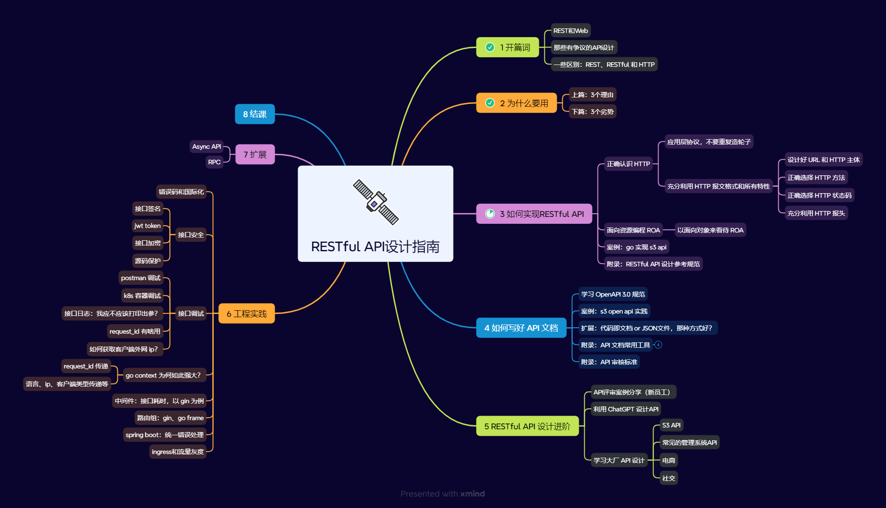

# RESTful API 设计指南

深入浅出 RESTful API 设计，和作者一起学习如何设计好，如何正确的设计 API 吧！

summary:

- [01 开篇词](01_开篇词.md)
- [02 为什么要用（上）](02_为什么要用（上）.md)
- [02 为什么要用（下）](02_为什么要用（下）.md)
- [03 如何实现 RESTful API](03/README.md)
  - [正确认识 HTTP 协议](03_正确认识HTTP协议.md)
  - [面向资源编程 ROA](03_面向资源编程ROA.md)