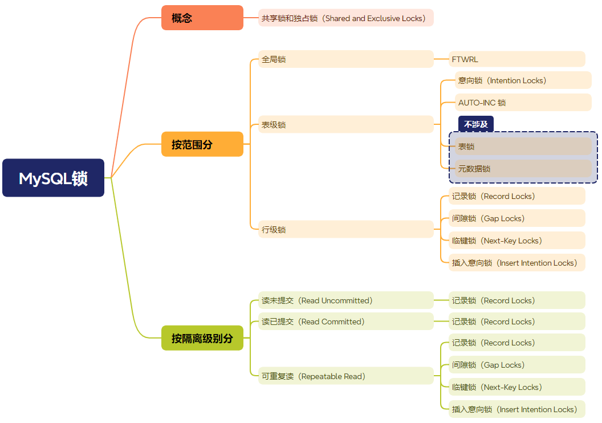

# MySQL锁的种类

根据官方文档 [InnoDB Locking](https://dev.mysql.com/doc/refman/5.7/en/innodb-locking.html#innodb-gap-locks)，总共有如下8种常见的锁：

- 共享锁和独占锁（Shared and Exclusive Locks）
- 意向锁（Intention Locks）
- 记录锁（Record Locks）
- 间隙锁（Gap Locks）
- 临键锁（Next-Key Locks）
- 插入意向锁（Insert Intention Locks）
- AUTO-INC Locks
- Predicate Locks for Spatial Indexes

其中，前 6 种会经常用到，也是本文主要的介绍重点。

## 锁的分类

根据官方文档介绍的8种锁进行分类后如下：

按照锁的范围，分成全局锁、表级锁和行锁，其中意向锁（Intention Locks）是表锁，其他4种都是行锁。

按照隔离级别分，间隙锁、临键锁和插入意向锁都是在可重复读级别下使用，其他级别只有记录锁。

## 参考

- [InnoDB Locking](https://dev.mysql.com/doc/refman/5.7/en/innodb-locking.html#innodb-gap-locks)
- [MySQL锁系列（一）之锁的种类和概念](https://keithlan.github.io/2017/06/05/innodb_locks_1/)