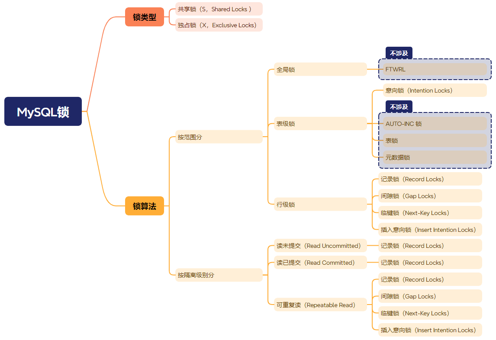

# MySQL锁的种类

根据官方文档 [InnoDB Locking](https://dev.mysql.com/doc/refman/5.7/en/innodb-locking.html#innodb-gap-locks)，总共有如下8种常见的锁：

- 共享锁和独占锁（Shared and Exclusive Locks）
- 意向锁（Intention Locks）
- 记录锁（Record Locks）
- 间隙锁（Gap Locks）
- 临键锁（Next-Key Locks）
- 插入意向锁（Insert Intention Locks）
- AUTO-INC Locks
- Predicate Locks for Spatial Indexes

其中，前 6 种会经常用到，也是本文主要的介绍重点。

注意：本文虽然翻译 MySQL 5.7 文档，但为了便于理解，使用 MySQL 8.0 打印当前锁列表，下文不在强调。

> PS：本文大部分内容来自官方文档，有改编。

## 锁的分类



从*锁的类型*看，分成共享锁（S）和独占锁（X）。在不同的实现算法中都支持这2种类型的锁，比如通过 *select lock in share mode* 获取共享锁（S），通过 *select for update* 获取独占锁（X），具体的加锁算法就得看 sql 语句的 where 条件和索引了。

在可重复读隔离级别（Repeatable Read）下，如果我们使用的是唯一索引（主键也是唯一索引），使用等值查询如 where id=3，且记录存在能命中，则对应加的是共享记录锁（S，Record Locks）和独占记录锁（X，Record Locks），否则 Next-Key 锁退化成间隙锁，则对应加的是共享间隙锁（S，Gap Locks）和独占间隙锁（X，Gap Locks）。

从**锁的范围**看，分成全局锁、表级锁和行锁，而日常开发中，主要使用的是行锁，表级和全局锁大多数只在运维的时候使用。

从**事务隔离级别**看，记录锁只能解决更新和删除的问题，没有办法阻止插入。所以在更高的事务隔离级别中（可重复读），为了阻止插入（解决幻读问题），innodb 引入了间隙锁（Gap Locks）的概念。间隙锁可以重复获取，且允许在同一个范围插入不同的数据，以提升间隙锁下并发插入的性能。

对于初学者而言，对数据库锁的初步认知大多是通过如下语法了解的：

```sql
-- 互斥锁(独占锁、写锁)：允许持有该锁的事务更新或删除行
begin;
select * from student where id = 2 for update;
-- ...
commit;

-- 共享锁(读锁)：允许持有该锁的事务读取一行
begin;
select * from student where id = 2 lock in share mode;
commit;
```

> PS：读锁和写锁是冲突的，读读兼容、读写冲读、写写冲突。所以，在读多写少的业务场景下的，读写锁拥有更高的性能。反之，写多读少的场景，读写锁反而不如互斥锁。

但是，在 innodb 引擎中，如下 sql 也会自动加锁：

```sql
update course set name="学不会的mysql" where id = 2;
delete from course where id = 2;
```

具体加什么锁，取决于sql语句、索引和事务隔离级别等。所以分析 sql 死锁是比较困难的，有时候需要深入研究并且理解了 innodb 支持的各种锁，才能分析出结果。

## 共享锁和独占锁（Shared and Exclusive Locks）

InnoDB实现标准行级锁定，其中有两种类型的锁： 共享锁 (S) 和排它锁 (X)

- 共享锁(S)：允许持有该锁的事务读取一行
- 独占锁(X)：允许持有该锁的事务更新或删除行

如果事务 T1 持有行 r 的共享 (S) 锁，则来自某个不同的事务 T2 对行 r 锁的请求将按如下方式处理： 

- T2 请求共享锁(S)，授予请求，此时 T1 和 T2 都持有 r 行的共享锁(S)
- T2 请求独占锁(X)，因为和共享锁(S)冲突，所以无法授予请求，故事务 T2 被阻塞

如果事务 T1 持有行 r 的独占锁(X)，则其他事务对行 r 任一类型的锁的请求不能立即被授予，必须得等待事务 T1 释放对行 r 的锁定。

共享锁(S)和独占锁(X)的兼容关系如下：
| | X | S |
|-|-|-|
| X | 冲突 | 冲突 |
| S | 冲突 | 兼容 |

## 意向锁（Intention Locks）

InnoDB支持多粒度锁定，允许行锁和表锁共存，例如 *LOCK TABLES ... WRITE* 采用排他锁（x）锁定一张指定的表。为了使多粒度级别的锁定切实可行，InnoDB 使用意向锁。意向锁是**表级锁**，指示事务稍后需要对表中的行使用哪种类型的锁（共享或独占）。

> PS：获取行锁之前都需要获取表锁（意向锁），意向锁的作用是为了快速判断行锁的兼容性，以提升性能。

意向锁有两种类型：

- 意向共享锁(IS)：表示事务打算在表中的某个行设置*共享锁(S)*。
- 意向排它锁(IX)：表示事务打算对表中的某个行设置*排它锁(X)*。

比如 *SELECT ... LOCK IN SHARE MODE* 会先设置 IS 锁，*SELECT ... FOR UPDATE* 会先设置 IX 锁。

如下是一个 *for update* 的示例，就先获取了表级的 *IX* 锁，然后才获取间隙锁：

```sql
$ select * from test_gap_lock where id=9 for update;
$ select ENGINE_TRANSACTION_ID,EVENT_ID,INDEX_NAME,LOCK_TYPE,LOCK_MODE,LOCK_STATUS,LOCK_DATA from performance_schema.data_locks;
+-----------------------+----------+------------+-----------+-----------+-------------+-----------+
| ENGINE_TRANSACTION_ID | EVENT_ID | INDEX_NAME | LOCK_TYPE | LOCK_MODE | LOCK_STATUS | LOCK_DATA |
+-----------------------+----------+------------+-----------+-----------+-------------+-----------+
|                  1875 |       36 | NULL       | TABLE     | IX        | GRANTED     | NULL      |
|                  1875 |       36 | PRIMARY    | RECORD    | X,GAP     | GRANTED     | 10        |
+-----------------------+----------+------------+-----------+-----------+-------------+-----------+
```

> PS：本文虽然翻译 MySQL 5.7 文档，但为了更直观和准确，使用 MySQL 8.0 的输出，便于理解，下文不在强调。MySQL 5.7 查询锁列表：select * from information_schema.innodb_locks;

意向锁定协议如下：

- 在事务可以获取表中行的共享锁(S)之前，它必须首先获取表的IS锁或更强的锁。
- 在事务可以获取表中行的排他锁(X)之前，它必须首先获取表的IX锁或更强的锁。

表级锁类型兼容性总结在以下矩阵中：

|  | X | IX | S | IS |
|-|-|-|-| - |
|X | 冲突 | 冲突| 冲突 | 冲突 |
|IX | 冲突 | 兼容的 | 冲突 | 兼容的 |
|S | 冲突 | 冲突 | 兼容的 | 兼容的 |
|IS | 冲突 | 兼容的 | 兼容的| 兼容的 |

如果事务请求的锁与现有锁兼容，则将锁授予该事务，否则不会授予锁，事务会等待，直到现有锁被释放。如果一个锁请求与已存在的锁发生冲突，并且由于会导致死锁而无法被授予，那么就会发生错误。

意向锁不会阻止除全表请求之外的任何内容（例如 *LOCK TABLES ... WRITE*），意向锁的主要目的是表明有人正在或者将要锁定一行。

意向锁在 InnoDB 监视器 *SHOW ENGINE INNODB STATUS* 中输出以下类似内容 ：

```sql
TABLE LOCK table `test`.`t` trx id 10080 lock mode IX
```

在 MySQL 8.0 的 *performance_schema.data_locks* 中输出：

```sql
| ENGINE_TRANSACTION_ID | EVENT_ID | INDEX_NAME | LOCK_TYPE | LOCK_MODE | LOCK_STATUS | LOCK_DATA |
| 1875 | 36 | NULL | TABLE | IX | GRANTED | NULL |
```

## 记录锁（Record Locks）

记录锁锁的是索引上的某一条记录，例如 *SELECT c1 FROM t WHERE c1 = 10 FOR UPDATE;* 可以防止任何其他事务插入、更新或删除 c1 值为 10 的行（可重复读事务隔离级别下）。

记录锁始终锁定索引记录，即使表中的列表没有索引。对于这种情况，InnoDB 创建一个隐藏的聚集索引并使用该索引进行记录锁定。请参见 MySQL 文档 [第 14.6.2.1 节“聚集索引和二级索引”](https://dev.mysql.com/doc/refman/5.7/en/innodb-index-types.html)。

记录锁在 InnoDB 监视器 *SHOW ENGINE INNODB STATUS* 中输出以下类似内容：

```sql
trx id 10078 lock_mode X locks rec but not gap
-- 或者
trx id 10078 lock_mode S locks rec but not gap
```

在 MySQL 8.0 的 *performance_schema.data_locks* 中输出：

```sql
| ENGINE_TRANSACTION_ID | EVENT_ID | INDEX_NAME | LOCK_TYPE | LOCK_MODE     | LOCK_STATUS | LOCK_DATA |
|                  1881 |       49 | PRIMARY    | RECORD    | X,REC_NOT_GAP | GRANTED     | 1 |
```

## 间隙锁（Gap Locks）

间隙锁是对索引记录之间间隙的锁定，或者对第一个索引记录之前或最后一个索引记录之后的间隙的锁定。例如 *SELECT c1 FROM t WHERE c1 BETWEEN 10 and 20 FOR UPDATE;* 因为该范围内所有现有值之间的间隙已被锁定，故可防止其他事务将 *c1=15* 的值插入到 t 表中，无论该表中是否已存在列 *c1=15* 的值。

间隙可能跨越单个索引值、多个索引值，甚至是空的。

间隙锁是性能和并发之间的平衡，**并且只在可重复读隔离级别中使用**（串行化不考虑）。

对于使用**唯一索引**搜索唯一行的语句，不需要锁定间隙（这不包括仅搜索多列唯一索引的部分列的情况，在这种情况下，确实会发生间隙锁定）。例如，如果列 id 有唯一索引，则以下语句仅使用记录锁（Record Locks）锁定 id 为 100 的行，并且其他会话是否在前面的间隙插入行并不重要（唯一索引重复插入会报错）：

```sql
SELECT * FROM child WHERE id = 100;
```

如果 id 未建立索引或具有非唯一索引，则该语句会锁定前面的间隙。

这里还值得注意的是，不同事务可以在间隙上持有冲突锁。例如，事务 A 可以在某个间隙上持有共享间隙锁（间隙锁S），而事务 B 在同一间隙上持有独占间隙锁（间隙锁X）。允许冲突的间隙锁存在的原因是，如果一条记录从索引中被清除掉，那么不同事务持有该记录的间隙锁必须被合并。

间隙锁InnoDB是“纯粹抑制性的”，这意味着它们的唯一目的是防止其他事务插入到间隙中。**间隙锁可以共存。一个事务获取的间隙锁不会阻止另一事务在同一间隙上获取间隙锁**。共享间隙锁和独占间隙锁之间没有区别。它们彼此不冲突，并且执行相同的功能。

> PS: 间隙锁死锁经常发生在 select ... for update; insert into xxx values ... 的场景，就是因为间隙锁可以被重复获取，不互斥导致，案例中有介绍。

如果您将事务隔离级别更改为 *READ COMMITTED* 或启用 *innodb_locks_unsafe_for_binlog* 系统变量（现已弃用），可以显式禁用间隙锁。此时，间隙锁定对搜索和索引扫描禁用，并且仅用于外键约束检查和重复键检查。

禁用间隙锁后，MySQL 会评估 where 条件，释放不匹配行的记录锁。对于 UPDATE 语句，InnoDB 执行 “半一致”（semi-consistent）读取，从而将最新提交的版本返回给 MySQL，以便 MySQL 可以确定该行是否符合 UPDATE 条件。

间隙锁在 InnoDB 监视器 *SHOW ENGINE INNODB STATUS* 中输出以下类似内容：

```sql
RECORD LOCKS space id 281 page no 5 n bits 72 index idx_c of table `lc_3`.`a` trx id 133588125 lock_mode X locks gap before rec  
```

在 MySQL 8.0 的 *performance_schema.data_locks* 中输出：

```sql
| ENGINE_TRANSACTION_ID | EVENT_ID | INDEX_NAME     | LOCK_TYPE | LOCK_MODE     | LOCK_STATUS | LOCK_DATA                       |
|                  1881 |       49 | idx_descendant | RECORD    | X,GAP         | GRANTED     | 'b                         ', 4 |
```

## 临键锁（Next-Key Locks）

临键锁是索引记录上的记录锁（Record Locks）和索引记录之前的间隙上的间隙锁（Gap Locks）的组合。

> PS: 临键锁 = 记录锁 + 间隙锁

InnoDB 执行行级锁定的方式是，当它搜索或扫描表索引时，它会在遇到的索引记录上设置共享锁（S）或独占锁（X）。因此，行级锁实际上是索引记录锁（Record Locks）。一个索引记录上的 Next-Key 锁还影响该索引记录之前的"间隙"。也就是说，**Next-Key 锁是一个索引记录锁加上一个在该索引记录之前间隙的间隙锁**。如果一个会话在一个索引上持有记录 R 的共享锁或排他锁，另一个会话就不能在该索引顺序中 R 之前的间隙插入新的索引记录。

假设索引包含值 *10、11、13、20*，该索引可能的 Next-Key 锁涵盖以下区间，其中圆括号表示排除区间端点，方括号表示包含端点（左开右闭）：

```sql
(negative infinity, 10]
(10, 11]
(11, 13]
(13, 20]
(20, positive infinity)
```

> PS：如果都是圆括号 (11,13) 代表的是锁定了 11-13 的间隙（间隙锁），而没有锁定记录13本身

对于最后一个间隔，Next-Key 锁锁定了索引中最大值之上的间隙，以及一个值高于索引中任何实际值的 *supremum* 伪记录。*supremum* 不是一个真实的索引记录，因此，实际上这个 Next-Key 锁只锁定了跟在最大索引值之后的间隙。

默认情况下，InnoDB 在 *REPEATABLE READ* 事务隔离级别下使用 Next-Key 锁，以解决幻读问题（[请参阅第 14.7.4 节 “幻像行”](https://dev.mysql.com/doc/refman/5.7/en/innodb-next-key-locking.html)）。

临键锁在 InnoDB 监视器 *SHOW ENGINE INNODB STATUS* 中输出以下类似内容：

```sql
RECORD LOCKS space id 58 page no 3 n bits 72 index `PRIMARY` of table `test`.`t`
trx id 10080 lock_mode X
```

在 MySQL 8.0 的 *performance_schema.data_locks* 中输出：

```sql
| ENGINE_TRANSACTION_ID | EVENT_ID | INDEX_NAME     | LOCK_TYPE | LOCK_MODE     | LOCK_STATUS | LOCK_DATA                       |
|                  1881 |       49 | idx_descendant | RECORD    | X             | GRANTED     | 'a                         ', 3 |
```

## 插入意向锁（Insert Intention Locks）

**插入意向锁是一种间隙锁，在执行 INSERT 插入之前设置**。此锁表明插入意图，插入同一索引间隙的多个事务如果插入位置不同，则无需互相等待。假设存在值为 4 和 7 的索引记录，2个事务分别尝试插入值 5 和 6 ，在获得插入行上的排他锁之前，都需要使用插入意向锁锁定 4 和 7 之间的间隙，但因为插入的行不冲突，所以不会互相阻塞。

以下示例演示了一个事务在获取插入记录上的排它锁（X）之前获取插入意向锁（Insert Intention Locks），该示例涉及两个客户端 A 和 B。

- 客户端A：创建一个包含两条索引记录（90和102）的表，然后启动一个事务，对 ID 大于 100 的索引记录放置排他锁，排他锁包括记录 102 之前的间隙锁

```sql
mysql> CREATE TABLE child (id int(11) NOT NULL, PRIMARY KEY(id)) ENGINE=InnoDB;
mysql> INSERT INTO child (id) values (90),(102);

mysql> START TRANSACTION;
mysql> SELECT * FROM child WHERE id > 100 FOR UPDATE;
+-----+
| id  |
+-----+
| 102 |
+-----+
```

- 客户端 B：开始事务，并将 101 的记录插入到间隙中，此时事务 B 获取到插入意向锁，等待获取排他锁（处于阻塞状态）

```sql
mysql> START TRANSACTION;
mysql> INSERT INTO child (id) VALUES (101); -- block
```

插入意向锁在 InnoDB 监视器 *SHOW ENGINE INNODB STATUS* 中输出以下类似内容：

```sql
trx id 8731 lock_mode X locks gap before rec insert intention waiting
```

在 MySQL 8.0 的 *performance_schema.data_locks* 中输出：

```sql
| ENGINE_TRANSACTION_ID | EVENT_ID | INDEX_NAME     | LOCK_TYPE | LOCK_MODE              | LOCK_STATUS | LOCK_DATA                        |
|                  1887 |       51 | idx_descendant | RECORD    | X,GAP,INSERT_INTENTION | WAITING     | 'a                         ', 2  |
```

## 小结

共享锁和独占锁是基本的2种锁类型，间隙锁、记录锁和NextKey锁都是具体的实现算法，他们可以是独占，也可以是共享的，我们可以使用 **for update** 和 **lock in share mode** 控制。

插入意向锁只应用于 insert 语句，是一种特殊的间隙锁。​

因为 MySQL 的 MyISAM 引擎不支持事务，也不支持行级锁，所以上述的锁都是指 InnoDB 引擎。

数据库经常使用读已提交（Read Committed）和可重复读（Repeatable Read）隔离级别，MySQL默认是可重复读，在该级别下，默认的加锁单位是临键锁（Next-Key），即会同时对记录和间隙加锁，根据索引的不同，如在唯一索引等值查询下会退化成记录锁，非唯一索引且记录不存在时会退化成间隙锁。

另外，从 *performance_schema.data_locks*（MySQL 5.7: information_schema.innodb_locks）表中，我们可以看到详细的加锁类型和锁定的数据范围，在 *show engine innodb status* 中能看到死锁的具体原因。

## 附录：锁的兼容矩阵

> PS：横向是已经持有的锁，纵向是正在申请的锁

意向锁(IS,IX)和共享独占锁(S,X)：
|  | X | IX | S | IS |
|-|-|-|-| - |
|X | 冲突 | 冲突| 冲突 | 冲突 |
|IX | 冲突 | 兼容的 | 冲突 | 兼容的 |
|S | 冲突 | 冲突 | 兼容的 | 兼容的 |
|IS | 冲突 | 兼容的 | 兼容的| 兼容的 |

临键值锁、间隙锁、记录锁和插入意向锁：
| | 间隙锁（Gap Locks） | 插入意向锁（Insert Intention Locks） | 记录锁（Record Locks） | 临建锁（Next-Key Locks）|
|-|-|-|-|-|
| 间隙锁（Gap Locks）|  兼容 | 冲突 | 兼容 | 兼容 |
| 插入意向锁（Insert Intention Locks）| 冲突 |兼容 | 兼容 | 冲突 |
| 记录锁（Record Locks）| 兼容 | 兼容 | 冲突 | 冲突 |
| 临建锁（Next-Key Locks）| 兼容|兼容| 冲突 | 冲突 |

> PS：间隙锁死锁后，可以根据这个图来判断那些锁不兼容，从而导致死锁。

## 附录：锁速查表

> PS：看不懂 show engine innodb status 中输出的锁种类，看这个表

1. 共享锁和独占锁（Shared and Exclusive Locks）

```sql
select * from xx where a=1 lock in share mode;
select * from xx where a=1 for update;
```

2. 意向锁（Intention Locks）

```sql
-- 意向共享和独占锁，performance_schema.data_locks 中为： IS & IX
TABLE LOCK table `lc_3`.`a` trx id 133588125 lock mode IS
TABLE LOCK table `lc_3`.`a` trx id 133588125 lock mode IX
```

3. 记录锁（Record Locks）

```sql
-- 记录共享独占锁，performance_schema.data_locks 中为：S,REC_NOT_GAP & X,REC_NOT_GAP
... lock_mode S locks rec but not gap
... lock_mode X locks rec but not gap
```

4. 间隙锁（Gap Locks）

```sql
-- 间隙共享锁和独占锁，performance_schema.data_locks 中为：S,GAP & X,GAP
... lock_mode S locks gap before rec
... lock_mode X locks gap before rec
```

5. 临键锁（Next-Key Locks）

```sql
-- 临键共享锁和独占锁，performance_schema.data_locks 中为：S & X
... lock_mode S
... lock_mode X
```

6. 插入意向锁（Insert Intention Locks）

```sql
-- performance_schema.data_locks 中为：X,GAP,INSERT_INTENTION
... lock_mode X insert intention waiting
```

## 参考

- [InnoDB Locking](https://dev.mysql.com/doc/refman/5.7/en/innodb-locking.html#innodb-gap-locks)
- [MySQL锁系列（一）之锁的种类和概念](https://keithlan.github.io/2017/06/05/innodb_locks_1/)
- [36 | 记一次线上SQL死锁事故：如何避免死锁？](https://time.geekbang.org/column/article/117247)
- [MySQL 全局锁、表级锁、行级锁，你搞清楚了吗？](https://www.cnblogs.com/xiaolincoding/p/16820726.html)
