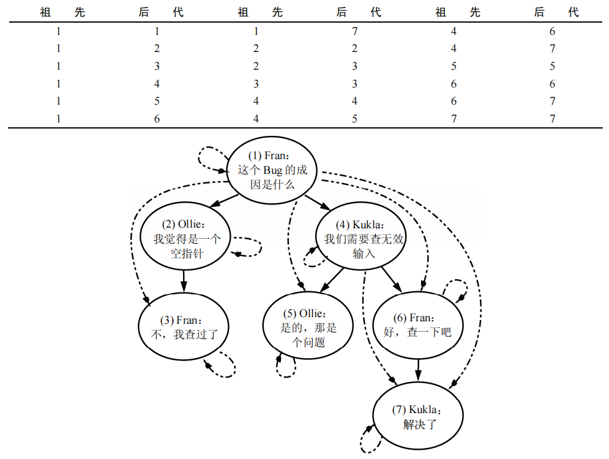

# 间隙锁案例2：云盘系统

## 背景

云盘文件系统中，元数据表会存储文件相关元数据信息，比如文件名称、父目录id、文件大小等。

其中用于表示文件层次结构的树模型主要有3种：

- 邻接表：通过 parentId 动态维护层次结构，查询路径时需要递归。
- 路径枚举：通过一个 path 字段冗余全路径。
- 闭包表：通过维护所有后代和祖先的关系，可以实现子树场景的查询。

其中，闭包表因为可以支持子树场景的查询，故在组织架构、云盘系中有所应用。


闭包表的缺点是移动文件时，需要先删除关系，然后再新建，而不能像邻接表那样，通过更改 parentId 指向新的目录即可，因而闭包表模型下，目录的移动必须是在一个事务中执行。所以，在并发操作场景下，如何确保移动目录操作和其他操作的正确性，显得至关重要。

## 准备数据

有如下路径：

```bash
test
├── a
└── b
```

根据闭包表的定义，表结构为：

```sql
CREATE TABLE `metadata_closure` (
  `id` int(11) NOT NULL AUTO_INCREMENT COMMENT '自增主键',
  `ancestor` char(32) NOT NULL COMMENT '祖先objectId',
  `descendant` char(32) NOT NULL COMMENT '后代objectId',
  `depth` int(11) NOT NULL COMMENT '层级深度，自己到自己的深度为0',
  PRIMARY KEY (`id`),
  KEY `idx_ancestor` (`ancestor`),
  KEY `idx_descendant` (`descendant`)
) ENGINE=InnoDB COMMENT='元数据路径表';
```

则需要插入数据为：

```sql
insert into test_closure values
(1, "test", "test", 0),
(2, "test", "a", 1),
(3, "a", "a", 0),
(4, "test", "b", 1),
(5, "b", "b", 0);
```

## 移动 和 上传 SQL 实现

假设：

- 事务A：移动 a 到 b 目录下
- 事务B：在 a 下上传文件 1.txt

对应 SQL 实现为：

| 步骤 | 事务A(a移动到b) | 事务B(a文件夹下上传1.txt)|
|-|-|-|
| T1 | begin; | |
| T2 | <span style="color:green">-- 检查源路径（gns://test/a）和目标路径（gns://test/b）是否存在，上锁</span><br />select count(1) from test_closure where ancestor="test" and descendant = "a" for update;<br/>select count(1) from test_closure where ancestor="test" and descendant = "b" for update;| begin; |
| T3 | <span style="color:green">-- 查询a所有子节点和祖先的关系，便于下面的删除</span><br />select id from test_closure WHERE descendant IN (SELECT descendant FROM test_closure WHERE ancestor='a') AND ancestor IN (SELECT ancestor FROM test_closure WHERE descendant='a' AND ancestor != descendant); | <span style="color:green">-- 检查上传路径 gns://test/a 是否存在</span><br />select count(1) from test_closure where ancestor="test" and descendant = "a" for update;<br /><strong style="color:red">block</strong> |
| T5 | <span style="color:green">-- 删除 ("test", "a", 1)，即断开 a 和所有祖先的连接</span><br />delete FROM test_closure where id in(2); | |
| T6 | <span style="color:green">-- 将上一步分离出的子树用笛卡尔积嫁接到节点 b 下</span><br/>INSERT INTO test_closure(ancestor,descendant,depth) SELECT T1.ancestor, T2.descendant, T1.depth + T2.depth + 1 FROM test_closure as T1 CROSS JOIN test_closure as T2 WHERE T1.descendant="b" AND T2.ancestor="a";| |
| T7 | commit | <span style="color:green">-- 插入叶子节点</span><br/>insert into test_closure (ancestor, descendant,depth) select t.ancestor, '1.txt',t.depth+1 from test_closure as t where t.descendant = 'a' union all select '1.txt','1.txt',0; |
| T8 | | <span style="color:green">-- 结果正确，也没有出现死锁</span><br/>commit;|

## 案例1：正常顺序

先执行事务 A T2中的2条SQL：

```sql
select count(1) from test_closure where ancestor="test" and descendant = "a" for update;
select count(1) from test_closure where ancestor="test" and descendant = "b" for update;
```

- 第一条

```sql
$ select ENGINE_TRANSACTION_ID,EVENT_ID,INDEX_NAME,LOCK_TYPE,LOCK_MODE,LOCK_STATUS,LOCK_DATA from performance_schema.data_locks;
+-----------------------+----------+----------------+-----------+---------------+-------------+---------------------------------+
| ENGINE_TRANSACTION_ID | EVENT_ID | INDEX_NAME     | LOCK_TYPE | LOCK_MODE     | LOCK_STATUS | LOCK_DATA                       |
+-----------------------+----------+----------------+-----------+---------------+-------------+---------------------------------+
|                  1881 |       49 | NULL           | TABLE     | IX            | GRANTED     | NULL                            |
|                  1881 |       49 | idx_descendant | RECORD    | X             | GRANTED     | 'a                         ', 2 |
|                  1881 |       49 | idx_descendant | RECORD    | X             | GRANTED     | 'a                         ', 3 |
|                  1881 |       49 | PRIMARY        | RECORD    | X,REC_NOT_GAP | GRANTED     | 1                               |
|                  1881 |       49 | PRIMARY        | RECORD    | X,REC_NOT_GAP | GRANTED     | 2                               |
|                  1881 |       49 | PRIMARY        | RECORD    | X,REC_NOT_GAP | GRANTED     | 3                               |
|                  1881 |       49 | PRIMARY        | RECORD    | X,REC_NOT_GAP | GRANTED     | 4                               |
|                  1881 |       49 | idx_ancestor   | RECORD    | X             | GRANTED     | 'test                      ', 1 |
|                  1881 |       49 | idx_ancestor   | RECORD    | X             | GRANTED     | 'test                      ', 2 |
|                  1881 |       49 | idx_ancestor   | RECORD    | X             | GRANTED     | 'test                      ', 4 |
|                  1881 |       49 | idx_descendant | RECORD    | X,GAP         | GRANTED     | 'b                         ', 4 |
+-----------------------+----------+----------------+-----------+---------------+-------------+---------------------------------+
```

- 第二条

```sql
select ENGINE_TRANSACTION_ID,EVENT_ID,INDEX_NAME,LOCK_TYPE,LOCK_MODE,LOCK_STATUS,LOCK_DATA from performance_schema.data_locks;
+-----------------------+----------+----------------+-----------+---------------+-------------+---------------------------------+
| ENGINE_TRANSACTION_ID | EVENT_ID | INDEX_NAME     | LOCK_TYPE | LOCK_MODE     | LOCK_STATUS | LOCK_DATA                       |
+-----------------------+----------+----------------+-----------+---------------+-------------+---------------------------------+
|                  1881 |       49 | NULL           | TABLE     | IX            | GRANTED     | NULL                            |
|                  1881 |       49 | idx_descendant | RECORD    | X             | GRANTED     | 'a                         ', 2 |
|                  1881 |       49 | idx_descendant | RECORD    | X             | GRANTED     | 'a                         ', 3 |
|                  1881 |       49 | PRIMARY        | RECORD    | X,REC_NOT_GAP | GRANTED     | 1                               |
|                  1881 |       49 | PRIMARY        | RECORD    | X,REC_NOT_GAP | GRANTED     | 2                               |
|                  1881 |       49 | PRIMARY        | RECORD    | X,REC_NOT_GAP | GRANTED     | 3                               |
|                  1881 |       49 | PRIMARY        | RECORD    | X,REC_NOT_GAP | GRANTED     | 4                               |
|                  1881 |       49 | idx_ancestor   | RECORD    | X             | GRANTED     | 'test                      ', 1 |
|                  1881 |       49 | idx_ancestor   | RECORD    | X             | GRANTED     | 'test                      ', 2 |
|                  1881 |       49 | idx_ancestor   | RECORD    | X             | GRANTED     | 'test                      ', 4 |
|                  1881 |       49 | idx_descendant | RECORD    | X,GAP         | GRANTED     | 'b                         ', 4 |
...
|                  1881 |       49 | idx_descendant | RECORD    | X             | GRANTED     | 'b                         ', 4 |
|                  1881 |       49 | idx_descendant | RECORD    | X             | GRANTED     | 'b                         ', 5 |
|                  1881 |       49 | PRIMARY        | RECORD    | X,REC_NOT_GAP | GRANTED     | 5                               |
|                  1881 |       49 | idx_ancestor   | RECORD    | X             | GRANTED     | supremum pseudo-record          |
+-----------------------+----------+----------------+-----------+---------------+-------------+---------------------------------+
```

再执行事务 B 中的 T3 中的SQL：

```sql
select count(1) from test_closure where ancestor="test" and descendant = "a" for update;
```

查看锁：

```sql
$ select ENGINE_TRANSACTION_ID,EVENT_ID,INDEX_NAME,LOCK_TYPE,LOCK_MODE,LOCK_STATUS,LOCK_DATA from performance_schema.data_locks;
+-----------------------+----------+----------------+-----------+---------------+-------------+---------------------------------+
| ENGINE_TRANSACTION_ID | EVENT_ID | INDEX_NAME     | LOCK_TYPE | LOCK_MODE     | LOCK_STATUS | LOCK_DATA                       |
+-----------------------+----------+----------------+-----------+---------------+-------------+---------------------------------+
|                  1882 |       41 | NULL           | TABLE     | IX            | GRANTED     | NULL                            |
|                  1882 |       41 | idx_descendant | RECORD    | X             | WAITING     | 'a                         ', 2 |
```

## 案例2：调整顺序后死锁

如果按照上述顺序执行，则结果符合预期。但如果调整顺序，按照下面的顺序执行，则出现死锁：

| 步骤 | 事务A(a移动到b) | 事务B(a文件夹下上传1.txt)|
|-|-|-|
| T1 | begin; | begin; |
| T2 |  | <span style="color:green">-- 检查上传路径 gns://test/a 是否存在</span><br />select count(1) from test_closure where ancestor="test" and descendant = "a" for update; |
| T3 | <span style="color:green">-- 检查源路径（gns://test/a）和目标路径（gns://test/b）是否存在，上锁</span><br />select count(1) from test_closure where ancestor="test" and descendant = "a" for update;<br /><strong style="color:red">block</strong>|  |
| T4 | | <span style="color:green">-- 插入叶子节点</span><br/>insert into test_closure (ancestor, descendant,depth) select t.ancestor, '1.txt',t.depth+1 from test_closure as t where t.descendant = 'a' union all select '1.txt','1.txt',0; |
| T5 | <strong style="color:red">ERROR 1213 (40001): Deadlock found when trying to get lock; try restarting transaction</strong> |  |
| T6 |  | commit |

T2时锁：

```sql
select ENGINE_TRANSACTION_ID,EVENT_ID,INDEX_NAME,LOCK_TYPE,LOCK_MODE,LOCK_STATUS,LOCK_DATA from performance_schema.data_locks;
+-----------------------+----------+----------------+-----------+---------------+-------------+---------------------------------+
| ENGINE_TRANSACTION_ID | EVENT_ID | INDEX_NAME     | LOCK_TYPE | LOCK_MODE     | LOCK_STATUS | LOCK_DATA                       |
+-----------------------+----------+----------------+-----------+---------------+-------------+---------------------------------+
|                  1887 |       50 | NULL           | TABLE     | IX            | GRANTED     | NULL                            |
|                  1887 |       50 | idx_descendant | RECORD    | X             | GRANTED     | 'a                         ', 2 |
|                  1887 |       50 | idx_descendant | RECORD    | X             | GRANTED     | 'a                         ', 3 |
|                  1887 |       50 | PRIMARY        | RECORD    | X,REC_NOT_GAP | GRANTED     | 1                               |
|                  1887 |       50 | PRIMARY        | RECORD    | X,REC_NOT_GAP | GRANTED     | 2                               |
|                  1887 |       50 | PRIMARY        | RECORD    | X,REC_NOT_GAP | GRANTED     | 3                               |
|                  1887 |       50 | PRIMARY        | RECORD    | X,REC_NOT_GAP | GRANTED     | 4                               |
|                  1887 |       50 | idx_ancestor   | RECORD    | X             | GRANTED     | 'test                      ', 1 |
|                  1887 |       50 | idx_ancestor   | RECORD    | X             | GRANTED     | 'test                      ', 2 |
|                  1887 |       50 | idx_ancestor   | RECORD    | X             | GRANTED     | 'test                      ', 4 |
|                  1887 |       50 | idx_descendant | RECORD    | X,GAP         | GRANTED     | 'b                         ', 4 |
+-----------------------+----------+----------------+-----------+---------------+-------------+---------------------------------+
```

T3时锁：

```sql
select ENGINE_TRANSACTION_ID,EVENT_ID,INDEX_NAME,LOCK_TYPE,LOCK_MODE,LOCK_STATUS,LOCK_DATA from performance_schema.data_locks;
+-----------------------+----------+----------------+-----------+---------------+-------------+---------------------------------+
| ENGINE_TRANSACTION_ID | EVENT_ID | INDEX_NAME     | LOCK_TYPE | LOCK_MODE     | LOCK_STATUS | LOCK_DATA                       |
+-----------------------+----------+----------------+-----------+---------------+-------------+---------------------------------+
|                  1888 |       58 | NULL           | TABLE     | IX            | GRANTED     | NULL                            |
|                  1888 |       58 | idx_descendant | RECORD    | X             | WAITING     | 'a                         ', 2 |
+-----------------------+----------+----------------+-----------+---------------+-------------+---------------------------------+
```

T4时锁：

```sql
select ENGINE_TRANSACTION_ID,EVENT_ID,INDEX_NAME,LOCK_TYPE,LOCK_MODE,LOCK_STATUS,LOCK_DATA from performance_schema.data_locks;
+-----------------------+----------+----------------+-----------+------------------------+-------------+----------------------------------+
| ENGINE_TRANSACTION_ID | EVENT_ID | INDEX_NAME     | LOCK_TYPE | LOCK_MODE              | LOCK_STATUS | LOCK_DATA                        |
+-----------------------+----------+----------------+-----------+------------------------+-------------+----------------------------------+
|                  1887 |       50 | PRIMARY        | RECORD    | X,REC_NOT_GAP          | GRANTED     | 1                                |
|                  1887 |       50 | PRIMARY        | RECORD    | X,REC_NOT_GAP          | GRANTED     | 2                                |
|                  1887 |       50 | PRIMARY        | RECORD    | X,REC_NOT_GAP          | GRANTED     | 3                                |
|                  1887 |       50 | PRIMARY        | RECORD    | X,REC_NOT_GAP          | GRANTED     | 4                                |
|                  1887 |       50 | idx_descendant | RECORD    | X,GAP                  | GRANTED     | '1.txt                     ', 22 |
|                  1887 |       50 | idx_descendant | RECORD    | X,GAP                  | GRANTED     | '1.txt                     ', 23 |
|                  1887 |       50 | idx_descendant | RECORD    | X,GAP                  | GRANTED     | '1.txt                     ', 24 |
|                  1887 |       51 | idx_descendant | RECORD    | X,GAP,INSERT_INTENTION | GRANTED     | 'a                         ', 2  |
+-----------------------+----------+----------------+-----------+------------------------+-------------+----------------------------------+
```

MySQL 8死锁日志：

```sql
------------------------
LATEST DETECTED DEADLOCK
------------------------
2024-03-08 06:26:27 140294189299456
*** (1) TRANSACTION:
TRANSACTION 1892, ACTIVE 5 sec starting index read
mysql tables in use 2, locked 2
LOCK WAIT 2 lock struct(s), heap size 1128, 1 row lock(s)
MySQL thread id 34, OS thread handle 140294170400512, query id 863 172.17.0.1 root executing
select count(1) from test_closure where ancestor="test" and descendant = "a" for update

*** (1) HOLDS THE LOCK(S):
RECORD LOCKS space id 4 page no 6 n bits 80 index idx_descendant of table `go-cloud-driver`.`test_closure` trx id 1892 lock_mode X waiting
Record lock, heap no 3 PHYSICAL RECORD: n_fields 2; compact format; info bits 0
 0: len 26; hex 6120202020202020202020202020202020202020202020202020; asc a                         ;;
 1: len 4; hex 80000002; asc     ;;

*** (1) WAITING FOR THIS LOCK TO BE GRANTED:
RECORD LOCKS space id 4 page no 6 n bits 80 index idx_descendant of table `go-cloud-driver`.`test_closure` trx id 1892 lock_mode X waiting
Record lock, heap no 3 PHYSICAL RECORD: n_fields 2; compact format; info bits 0
 0: len 26; hex 6120202020202020202020202020202020202020202020202020; asc a                         ;;
 1: len 4; hex 80000002; asc     ;;


*** (2) TRANSACTION:
TRANSACTION 1891, ACTIVE 8 sec inserting
mysql tables in use 2, locked 2
LOCK WAIT 6 lock struct(s), heap size 1128, 11 row lock(s), undo log entries 1
MySQL thread id 33, OS thread handle 140294171457280, query id 864 172.17.0.1 root executing
insert into test_closure (ancestor, descendant,depth) select t.ancestor, '1.txt',t.depth+1 from test_closure as t where t.descendant = 'a' union all select '1.txt','1.txt',0

*** (2) HOLDS THE LOCK(S):
RECORD LOCKS space id 4 page no 6 n bits 80 index idx_descendant of table `go-cloud-driver`.`test_closure` trx id 1891 lock_mode X
Record lock, heap no 3 PHYSICAL RECORD: n_fields 2; compact format; info bits 0
 0: len 26; hex 6120202020202020202020202020202020202020202020202020; asc a                         ;;
 1: len 4; hex 80000002; asc     ;;

Record lock, heap no 4 PHYSICAL RECORD: n_fields 2; compact format; info bits 0
 0: len 26; hex 6120202020202020202020202020202020202020202020202020; asc a                         ;;
 1: len 4; hex 80000003; asc     ;;

*** (2) WAITING FOR THIS LOCK TO BE GRANTED:
RECORD LOCKS space id 4 page no 6 n bits 80 index idx_descendant of table `go-cloud-driver`.`test_closure` trx id 1891 lock_mode X locks gap before rec insert intention waiting
Record lock, heap no 3 PHYSICAL RECORD: n_fields 2; compact format; info bits 0
 0: len 26; hex 6120202020202020202020202020202020202020202020202020; asc a                         ;;
 1: len 4; hex 80000002; asc     ;;

*** WE ROLL BACK TRANSACTION (1)
```

根据 MySQL 8的死锁日志：

- 事务 A 持有 index idx_descendant 的 NextKey 锁，其中已获取到了间隙锁，但是记录锁无法获取，故被阻塞（waiting），等待获取 index idx_descendant 的记录锁（lock_mode X waiting），NextKey锁需要同时获取到间隙锁和记录锁才行。
- 事务 B 持有 index idx_descendant 的 NextKey 锁（lock_mode X），等待获取 index idx_descendant 的意向插入锁（lock_mode X locks gap before rec insert intention waiting），但是此时事务 A 已获取到间隙锁，故事务 B 被阻塞，2个事务互等陷入死锁，事务 A 被回滚，事务 B 继续执行

总结：

| 步骤 | 事务A(a移动到b) | 事务B(a文件夹下上传1.txt)|
|-|-|-|
| T1 | begin; | begin; |
| T2 |  | <span style="color:green">-- 检查上传路径 gns://test/a 是否存在</span><br />select count(1) from test_closure where ancestor="test" and descendant = "a" for update;<br/><span style="color:orange">-- 因为记录存在且非唯一索引，故需要同时获取间隙锁和记录锁，即NextKey临键锁</span> |
| T3 | <span style="color:green">-- 检查源路径（gns://test/a）和目标路径（gns://test/b）是否存在，上锁</span><br />select count(1) from test_closure where ancestor="test" and descendant = "a" for update;<br /><strong style="color:red">block</strong><br/><span style="color:orange">-- 获取到间隙锁，但无法获取到记录锁，被阻塞</span>|  |
| T4 | | <span style="color:green">-- 插入叶子节点</span><br/>insert into test_closure (ancestor, descendant,depth) select t.ancestor, '1.txt',t.depth+1 from test_closure as t where t.descendant = 'a' union all select '1.txt','1.txt',0; <br/><span style="color:orange">-- 需要获取插入意向锁，被事务 A 的间隙锁阻塞，同时阻塞，死锁</span>|
| T5 | <strong style="color:red">ERROR 1213 (40001): Deadlock found when trying to get lock; try restarting transaction</strong> |  |
| T6 |  | commit |

## 参考

- [初尝 Claude 3 分析 MySQL 死锁](https://mp.weixin.qq.com/s?__biz=MzkwMzE3OTQ1Nw==&mid=2247484201&idx=1&sn=a5dca966fdf57fe409c6573c15e68a09&chksm=c09b7e87f7ecf79139cfe34d14b7c2f979ed0c84e6262703078202535b42e8c64b08c462880d#rd)
