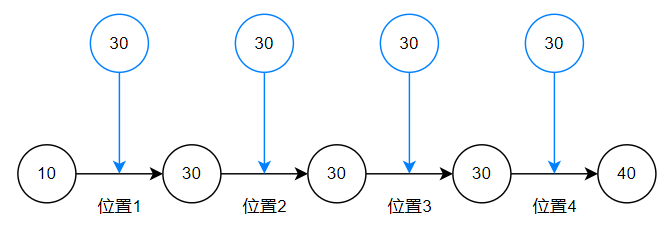

# 间隙锁FAQ

## 间隙锁和 NextKey 锁的区别

todo...

## 查询条件是自增id，间隙锁要怎么锁啊？

todo...

## 间隙锁死锁如何解决

todo...

## X，GAP 是什么意思？

X代表互斥锁，GAP代表间隙锁，所以表明本次加的锁是间隙独占锁，合并起来就是X，GAP。

类似的还有:

- 记录共享和独占锁：S，REC_NOT_GAP & X，REC_NOT_GAP
- 意向共享和独占锁：IS & IX
- Next-Key共享和独占锁：S & X
- 插入意向独占锁：X，GAP，INSERT_INTENTION

通过查询 `performance_schema.data_locks` 我们能看到类似这样的输出：

```sql
$ select ENGINE_TRANSACTION_ID，EVENT_ID，INDEX_NAME，LOCK_TYPE，LOCK_MODE，LOCK_STATUS，LOCK_DATA from performance_schema.data_locks;
+-----------------------+----------+------------+-----------+-----------+-------------+-----------+
| ENGINE_TRANSACTION_ID | EVENT_ID | INDEX_NAME | LOCK_TYPE | LOCK_MODE | LOCK_STATUS | LOCK_DATA |
+-----------------------+----------+------------+-----------+-----------+-------------+-----------+
|                  1875 |       36 | NULL       | TABLE     | IX        | GRANTED     | NULL      |
|                  1875 |       36 | PRIMARY    | RECORD    | X，GAP     | GRANTED     | 10        |
+-----------------------+----------+------------+-----------+-----------+-------------+-----------+
```

## 字符串如何加间隙锁？

闭包表移动案例，如何加间隙锁。

TODO....

## innodb 非唯一索引等值查询时，假设记录存在，除了锁定记录、记录前面的间隙，为什么还会锁定记录后面的间隙？

如果不对记录后面的间隙加锁，**无法阻止相同的记录插入**，此时就可能出现幻读。

如下有一个非唯一索引（为了便于理解，B+树我们简化成链表），索引包含值 (10,30,30,30,40) ，如果只锁定 (10,30) 的间隙和对30的记录加锁：


则当事务B执行：*insert into test values(null,30)* 时，此时是可以插入的，因为记录锁只会阻止其他事务更新或者删除，不阻止插入。

所以，当A在再执行：*select count(1) from test where c=30 for update* 的查询时，会发现多了一条记录，故需要对记录后面的间隙 (30,40) 也加锁，变成一个大的间隙(10,40)，则此时事务B会被阻塞，无法插入30的值，解决了非唯一索引下相同值插入的幻读问题。

innodb 加的锁具体如下：

```sql
+-----------------------+----------+------------+-----------+------------------------+-------------+-----------+
| ENGINE_TRANSACTION_ID | EVENT_ID | INDEX_NAME | LOCK_TYPE | LOCK_MODE              | LOCK_STATUS | LOCK_DATA |
+-----------------------+----------+------------+-----------+------------------------+-------------+-----------+
|                  2059 |       37 | NULL       | TABLE     | IX                     | GRANTED     | NULL      |
|                  2059 |       37 | idx_c      | RECORD    | X,GAP,INSERT_INTENTION | WAITING     | 40, 30    |
|                  2058 |       36 | NULL       | TABLE     | IX                     | GRANTED     | NULL      |
|                  2058 |       36 | idx_c      | RECORD    | X                      | GRANTED     | 30, 27    |
|                  2058 |       36 | idx_c      | RECORD    | X                      | GRANTED     | 30, 28    |
|                  2058 |       36 | idx_c      | RECORD    | X                      | GRANTED     | 30, 29    |
|                  2058 |       36 | PRIMARY    | RECORD    | X,REC_NOT_GAP          | GRANTED     | 27        |
|                  2058 |       36 | PRIMARY    | RECORD    | X,REC_NOT_GAP          | GRANTED     | 28        |
|                  2058 |       36 | PRIMARY    | RECORD    | X,REC_NOT_GAP          | GRANTED     | 29        |
|                  2058 |       36 | idx_c      | RECORD    | X,GAP                  | GRANTED     | 40, 30    |
+-----------------------+----------+------------+-----------+------------------------+-------------+-----------+
```

- 加了3个 next-key 锁，为 (10,30]
- 加了3个主键记录锁
- 加了一个间隙锁，为 (30,40)
- 事务B申请插入意向锁 (30,40) 被阻塞

这里有个疑惑，非唯一索引下，next-key 锁 (10,30] 和 (30,40) 间隙锁好像锁不住 30 的插入啊？询问 ChatGPT后，给出的回答是 innodb 可能做了合并操作，变成了 (10,40) 这个大间隙，所以能阻止 30 的插入。

## 参考

- [mysql 非唯一索引的等值查询为什么要加gap锁?](https://www.zhihu.com/question/346118963)
